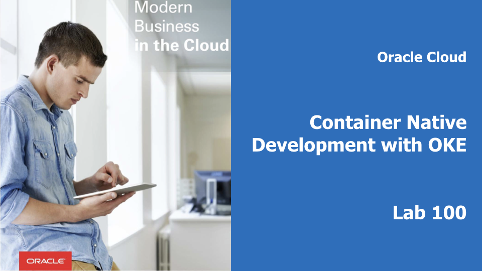
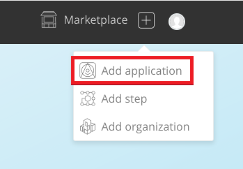
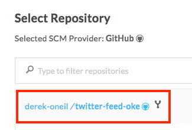
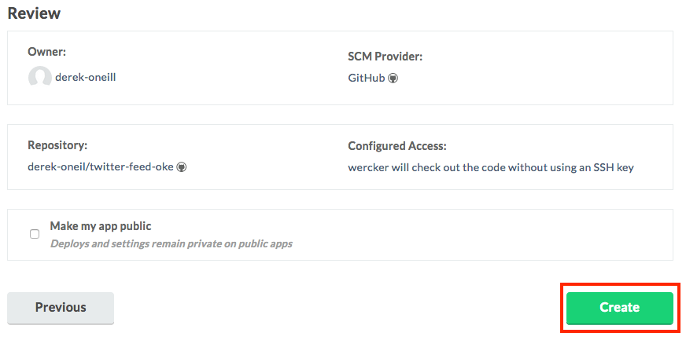

# Containerize Your Java Microservice

<!--  -->

## Introduction

본 Hands on Lab은 Container Native on OKE with Wercker 시리즈의 첫번째로, Oracle Cloud Infrastructure를 기반으로 Java로 만들어진 Application을 Container로 만들고 이를 Kubernetes Cluster환경에 배포하는 과정을 따라하면서 오라클의 컨테이너 기반 CI/CD 툴인 **Wercker**와 오라클의 쿠버네티스 서비스인 **OKE, Oracle Kubernetes Engine**을 경험해 보는 것을 목표로 합니다. 

## 학습목표

**자바 애플리케이션을 컨테이너로 만드는 일련의 과정을 자동화**

> Wercker는 네덜란드식 발음 **"베커"** 또는 영어식 발음 **"워커"**라고 부른다. 

- Wercker 애플리케이션 만들기 
  - GitHub에서 자바 애플리케이션 포크하기
  - Wercker 계정 만들기
  - Wercker 애플리케이션 만들기
- Wercker 파이프라인 생성 및 실행
  - 파이프라인과 워크플로우 생성
  - 빌드 파이프라인 정의
  - 환경변수 설정 
  - 배포 파이프라인 정의 
  - 워크플로우 실행 유효성 검사

## 선행 준비 사항 

이 Lab에서는 Github 계정이 필요합니다. 계정이 없으신 경우 아래 링크를 이용해 계정을 생성하세요.

  -  [GitHub account](https://github.com/join)

# 자바 애플리케이션을 컨테이너화하고 빌드 자동화하기 

## Wercker 애플리케이션 만들기

### **STEP 1**: GitHub에서 예제(자바) 애플리케이션 포크하기

- 브라우저에서 아래 링크로 이동:

    [https://github.com/derekoneil/twitter-feed-oke](https://github.com/derekoneil/twitter-feed-oke)

- 오른쪽 상단의 **Fork** 를 클릭하고 GitHub 계정으로 로그인 한다. 

  

### **STEP 2**: Wercker 계정 생성하기 

  **NOTE** Wercker 계정을 가지고 계신 계정을 이용하시면 되므로 **STEP 3**을 따라 하시면 됩니다. GitHub 계정으로 Wercker에 로그인 하기 위해 아래 과정을 따라 로그인 합니다. 

- 브라우저에서 아래 링크로 이동:
    [http://app.wercker.com/](http://app.wercker.com/)

- 오른쪽 상단 메뉴에 **Sign Up** 클릭하여 GitHub 계정으로 로그인

  

- **Sign Up Using GitHub** 클릭

  

-  **Authorize Wercker**  클릭

  

- Wercker에서 사용할 username과 email을 입력합니다. 

  

### **STEP 3**: Wercker 애플리케이션 생성

- Wercker 애플리케이션을 처음 만드는 경우는 파란색 **Create your first application** 버튼을 클릭. 이미 생성 경험이 있는 경우는 오른쪽위의 **plus button** 클릭하고  **Add application**를 클릭한다.:

  


- default 로 설정하고 **your account**  **GitHub**를 설정하고 **Next** 클릭

  

- 자신을 레포지터리에서 **twitter-feed-oke** 을 선택하고 **Next** 클릭

  

- default (without ssh key) 설정대로 하고 **Next** 클릭

  

- **Create** 클릭

  


## Wercker 빌드 파이프라인 생성 및 실행

### **STEP 4**: Pipelines Workflow 설정

- 새로 생성된 애플리케이션의 **Runs** 탭으로 이동, 이 Runs에서는 애플리케이션을 실행 이력을 볼 수 있다.  

  

- **Workflows** 탭을 이동. 이 워크플로우는 Git commit에 의해 기동(trigger)되며, **build** 라고 하는 파이프라인을 실행

  

- **build** 파이프라인은 애플리케이션 빌드와 Unit테스트에 이용된다. 새로운 파이프라인을 만들어 Docker image를 만들고 Docker Hub 레포지토리에 저장해 본다. **Add new pipeline** 버튼 클릭

  

- 파이프라인 Name과 YML Pipeline name 항목에 `push-release` 입력하고 **Create** 클릭

  

- 이제 파이프라인의 환경변수를 입력하는 항목은 비워둔다. **Workflows** 탭을 클릭해서 workflow editor 창으로 이동.

  

- **plus sign** 를 클릭.

  

- **Execute Pipeline** 항목에 좀전에 생성한 **push-release** 를 선택하고 **Add** 클릭.

  

- Now that we've got a workflow configured that will build and store a Docker image containing our application, we need to define exactly how to do that in a file called **wercker.yml**, which we will store in our application's Git repository.

### **STEP 5**: Wercker 빌드 파이프라인 정의

- 브라우저의 GitHub에 접속했던 탭으로 돌아가서, 좀전에 fork했던 **twitter-feed** 레포지토리에서 **Create new file** 클릭

  

- **Name your file...** 에 `wercker.yml` 입력

  

- **Edit new file** 에 다음 yaml 파일을 **붙여넣기** 한다.

    ```yaml
    #Use OpenJDK base docker image from dockerhub and open the application port on the docker container
    box:
      id: openjdk:8
      ports:
        - 8080

    #Build our application using Maven, just as we always have
    build:
      steps:
        - install-packages:
            packages: maven
        - script:
            name: maven build
            code: mvn clean assembly:assembly
    ```

- 에디터 창에 아래와 같은 YAML 파일을 갖게 된다. 

  

- YAML 파일의 첫번째 섹션은 docker base image를 정의하며, 두번째 섹션은 우리가 정의한 **Build** 파이프라인을 실행하도록 한다. 이 **Build** 파이프라인은 두개의 **steps** 로 구성되어 있다. 하나는  **install-packages** 필요한 패키지를 설치하고, 두번째는 shell 스크립트를 실행한다. 

- 화면의 제일 밑에 **Commit new file** 버튼을 클릭한다. 

  

- 브라우저의 **Wercker** 탭으로 돌아와서 **Runs** 탭을 보면 Git Commit에 의해 Trigger되서 실행되는 워크플로우를 볼수 있다. 

  

- **build** 파이프라인은 성공하지만, **push-release** 파이프라인은 아직 설정을 하지 않았기 때문에 실패한다. 

  

- 파란색 **build** 파이프라인을 클릭하면 실행 내역을 조회할 수 있고, 실패등의 이벤트를 이메일로 통지 받을 수 있다. 

  

- 이제 **push-release** 파이프라인을 수정해서 빌드한 컨테이너 이미지를 저장할 수 있는 **Oracle Container Image Registry(OCIR)** 의 환경변수를 설정한다. 

### **STEP 6**: Wercker에 환경 변수 설정

- In your Wercker browser tab, click the **Environment** tab.

  

- Create an environment variable by filling in the **Key** and **Value** boxes and clicking **Add**. _Be sure to click **Add**_ after each environment variable, or they will not be saved. Repeat this step for each variable listed below.

  ```
  Key:              Value:
  DOCKER_USERNAME   <your-tenancy-name>/<your-oracle-cloud-username>
  DOCKER_REGISTRY   iad.ocir.io
  DOCKER_REPO       <your-tenancy-name>/twitter-feed
  ```

  

  **NOTES**:

  - Replace `<your-tenancy-name>` and `<your-oracle-cloud-username>` in the variable values with the specific tenancy name and username for your cloud account.

  

  - Your tenancy name can be found under the User menu in the OCI Console:

  

  - Your Oracle Cloud username is the email address that you used when you created your trial account

  - The `DOCKER_REGISTRY` value above assumes your Oracle Cloud account is in the `iad` region, also known as `US-Ashburn`. We will confirm or correct this in the next lab.

- This is all of the environment variables that we can fill in at this point. However, we will need to provide one more piece of information to Wercker before we can successfully push an image to the OCIR Docker repository -- an OCI authentication token. We will log in to the OCI console and generate that token in Lab 200. For now, let's finish setting up the `push-release` pipeline in Wercker so that it will be ready to go once we have the token.

### **STEP 7**: Define Wercker Publish Pipeline

- Switch to your Github browser tab, click on the **wercker.yml** file, and click the **pencil icon** to begin editing.

  

- After the definition of the build pipeline, **paste** the following YAML:

    ```yaml
    #Push the docker image with our built and tested application to the Oracle Container Registry
    push-release:
      steps:
        - internal/docker-push:
            username: $DOCKER_USERNAME
            password: $OCI_AUTH_TOKEN
            repository: $DOCKER_REGISTRY/$DOCKER_REPO
            registry: https://$DOCKER_REGISTRY/v2
            tag: $WERCKER_GIT_BRANCH-$WERCKER_GIT_COMMIT
            working-dir: /pipeline/source
            ports: 8080
            cmd: sh target/bin/start
    ```

  

- This section of YAML defines our second pipeline, **push-release**. It uses a type of step we haven't seen before, **internal/docker-push**. This is a command developed by Wercker, which will take the current pipeline image and push it to a Docker registry. You can, however, use a different repository -- the step supports a `repository` parameter. You can find more info in the [documentation](http://devcenter.wercker.com/docs/steps/internal-steps#docker-push).

  There are two more things to note about this pipeline definition. First, the `cmd` parameter tells Docker how to start our application. Note that this is just the start script generated by Maven, exactly as we would have started it outside of Docker.

  Second, we have made use of several environment variables. We are tagging the release with the Git branch name and the Git commit hash so that we can trace our running application version back to a specific Git commit. These two variables (along with [others](http://devcenter.wercker.com/docs/environment-variables/available-env-vars#hs_cos_wrapper_name)) are automatically made available by Wercker. The `$DOCKER_USERNAME`, `$DOCKER_REGISTRY`, and `$DOCKER_REPO` environment variables, on the other hand, reference the ones that we defined ourselves in the previous step.

- At the bottom of the page, click **Commit changes**.

  

### **STEP 8**: Validate Workflow Execution

- As we learned earlier, we do not yet have enough information to enable Wercker to push the Docker image to OCIR -- we still need to generate an OCI authentication token and store it in a Wercker environment variable. Let's look at what happened to our workflow execution. Switch to your Wercker browser tab and click the **Runs** tab within Wercker. You'll see the workflow executing as a result of your Git commit.

  

- Once the workflow finishes, you'll see that the `build` pipeline was successfully completed, but that the `push-release` pipeline ended in an error. This is what we expected. In fact, if you click on the **push-release** pipeline that failed, you will see the `Anonymous users are only allowed read access on public repos` error message, indicating our lack of an authentication token. Let's move on to the next lab so we can log in to OCI, set up our Kubernetes infrastructure, and generate that token.

  

  

  **NOTE**: If you receive an error message that says `Tenant with name XYZ not found`, don't worry. Your cloud account may be in a different region than we specified in the environment variable above. We will correct that in the next lab, once we log in to the OCI console.

**You are now ready to move to the next lab: [Lab 200](LabGuide200.md)**

## Introduction

This is the first of several labs that are part of the **Oracle Public Cloud Container Native Development workshop.** This workshop will walk you through the process of moving an existing application into a containerized CI/CD pipeline and deploying it to a Kubernetes cluster in the Oracle Public Cloud.

You will take on 2 personas during the workshop. The **Lead Developer Persona** will be responsible for configuring the parts of the automated build and deploy process that involve details about the application itself. The **DevOps Engineer Persona** will configure the cloud infrastructure and provision the Kubernetes cluster. To containerize and automate the building and deploying of this application you will make use of Wercker Pipelines for CI/CD, Oracle Cloud Infrastructure Registry for a Docker container registry, and Oracle Container Engine for Kubernetes (OKE) to provision a Kubernetes cluster on Oracle Cloud Infrastructure.

During this lab, you will take on the **Lead Developer Persona** and work on containerizing your existing Java application. You will set up Wercker to monitor your application's source code repository for commits and automatically trigger a build, test, and package pipeline, which will result in a Docker image of your application that is ready to be deployed.

**_To log issues_**, click here to go to the [GitHub oracle](https://github.com/oracle/learning-library/issues/new) repository issue submission form.

## Objectives

**Containerize Your Java Application and Automate Building and Packaging**

- Create Wercker Application
  - Fork Java Application on GitHub
  - Create a Wercker account
  - Create Wercker application
- Create and Run Wercker Pipelines
  - Configure Pipelines and Workflow in Wercker
  - Define Wercker Build Pipeline
  - Set Environment Variables in Wercker
  - Define Wercker Publish Pipeline
  - Validate Workflow Execution

## Required Artifacts

For this lab you will need a Github account. Use the following link to set one up:

  - a [GitHub account](https://github.com/join)

# Containerize Your Java Application and Automate Builds

## Create Wercker Application

### **STEP 1**: Fork Java Application on GitHub

- From any browser, go to:

    [https://github.com/derekoneil/twitter-feed-oke](https://github.com/derekoneil/twitter-feed-oke)

- Click **Fork** in the upper right hand corner of the browser. **Sign in** if prompted.

  

  **NOTE:** If prompted, choose to fork the repository to your account (this may occur if your account is also a member of an organization on GitHub).

### **STEP 2**: Create a Wercker account

  **NOTE** If you already have a Wercker account, use your account to log into Wercker, and proceed to **STEP 3**. If you have not associated your existing Wercker account with your GitHub account, you can do so in the **Settings->Git Connections** menu, found in the user dropdown in the top right corner of Wercker.

- In a new browser tab, go to:
    [http://app.wercker.com/](http://app.wercker.com/)

- Click **Sign Up** in the upper right hand corner of the browser. Alternately, if you have already signed up for a Wercker account, click **log in** and then **log in with GitHub** and skip to **STEP 3**.

  

- Click **Sign Up Using GitHub**

  

- Click the green **Authorize Wercker** button

  

- Enter **a username and your email address** to complete your Wercker account creation

  

### **STEP 3**: Create a Wercker Application

- If this is your first Wercker application, click the blue **Create your first application** button. If you already have applications in your Wercker account, click the **plus button** in the upper right hand corner of the browser and select **Add application**:

  


- Leave the default selections of **your account** for the owner and **GitHub** for the SCM and click **Next**

  

- Click on the **twitter-feed-oke** repository that appears in the list of your GitHub repositories, then click **Next**

  

- Leave the default selection of checkout without an SSH key and click **Next**

  

- Click **Create**

  

- Do not generate a wercker.yml file -- we will create one in a later step.

## Create and Run Wercker Build Pipeline

### **STEP 4**: Configure Pipelines and Workflow in Wercker

- Navigate to the Wercker page for your newly-created application (you will already be on that page if you just completed **STEP 3**). Notice that you are viewing the **Runs** tab. This is where any executions of your workflow will be recorded.

  

- Click the **Workflows** tab. You will see that Wercker has created the beginning of a workflow for you already. This workflow is triggered by a Git commit and it will execute a pipeline called **build**.

  

- The **build** pipeline will be used to build and unit test our application. Let's create a new pipeline to store the resulting Docker image in a Docker Hub repository. Click the **Add new pipeline** button.

  

- Fill in `push-release` for the name of the pipeline and the YML name of the pipeline and click **Create**.

  

- You will be presented with the pipeline's environment variable screen. We do not need to add any pipeline-specific environment variables, so just click on the **Workflows** tab to return to the workflow editor.

  

- Click the **plus sign** next to the build pipeline in the editor.

  

- In the **Execute Pipeline** drop down list, choose the pipeline we just created, **push-release**. Leave the other fields at their default values and click **Add**.

  

- Now that we've got a workflow configured that will build and store a Docker image containing our application, we need to define exactly how to do that in a file called **wercker.yml**, which we will store in our application's Git repository.

### **STEP 5**: Define Wercker Build Pipeline

- Switch back to your GitHub browser tab, showing your forked copy of the **twitter-feed** repository, and click **Create new file**

  

- In the **Name your file...** input field, type `wercker.yml`

  

- In the **Edit new file** input box, **paste** the following:

    ```yaml
    #Use OpenJDK base docker image from dockerhub and open the application port on the docker container
    box:
      id: openjdk:8
      ports:
        - 8080

    #Build our application using Maven, just as we always have
    build:
      steps:
        - install-packages:
            packages: maven
        - script:
            name: maven build
            code: mvn clean assembly:assembly
    ```

- You should have **14 lines** of YAML in the editor:

  

- Let's look at the two sections of YAML that we've just added. The first section describes a **box**. A **box** is the image that you want Wercker to pull from a Docker registry (the default is Docker Hub) to build your pipeline from. In our case, we need a Java environment to run our application, so we will pull the **openjdk** image from Docker Hub.

  The second section defines our first pipeline, the **build** pipeline. Our **build** pipeline consists of two **steps**, one to install any packages required for our build process (**install-packages**), and one to execute a shell command to invoke the build (**script**).

  Since our application is built using Maven, we will instruct Wercker to install the Maven package first, using the **install-packages** step. Then we'll build the application the same way we would normally, invoking Maven in the **script** step.

- At the bottom of the page, click the **Commit new file** button.

  

- Switch back to your **Wercker** browser tab and click on the **Runs** tab. If you are quick enough, you will see that Wercker has been notified of your new Git commit (via a webhook) and is executing your workflow.

  

- You should see that the **build** pipeline completes successfully, but the **push-release** pipeline fails. That's what we expected, since we have not yet defined the steps for the **push-release** pipeline in our wercker.yml file.

  

- Click on the green **build** pipeline to drill into the details of each step. Note that you can click on each step to see the console output produced by that step. In our case that output includes things like the results of the tests that Maven executed before packaging our application. If any commands produce an error status code, Wercker will abort the workflow and notify you via email.

  

- Our next step is to define the second part of our workflow, the **push-release** pipeline, which will store our container image in a Docker repository (OCIR) after a successful **build**. This pipeline will make use of some environment variables, so let's get those set up first.

### **STEP 6**: Set Environment Variables in Wercker

- In your Wercker browser tab, click the **Environment** tab.

  

- Create an environment variable by filling in the **Key** and **Value** boxes and clicking **Add**. _Be sure to click **Add**_ after each environment variable, or they will not be saved. Repeat this step for each variable listed below.

  ```
  Key:              Value:
  DOCKER_USERNAME   <your-tenancy-name>/<your-oracle-cloud-username>
  DOCKER_REGISTRY   iad.ocir.io
  DOCKER_REPO       <your-tenancy-name>/twitter-feed
  ```

  

  **NOTES**:

  - Replace `<your-tenancy-name>` and `<your-oracle-cloud-username>` in the variable values with the specific tenancy name and username for your cloud account.

  

  - Your tenancy name can be found under the User menu in the OCI Console:

  

  - Your Oracle Cloud username is the email address that you used when you created your trial account

  - The `DOCKER_REGISTRY` value above assumes your Oracle Cloud account is in the `iad` region, also known as `US-Ashburn`. We will confirm or correct this in the next lab.

- This is all of the environment variables that we can fill in at this point. However, we will need to provide one more piece of information to Wercker before we can successfully push an image to the OCIR Docker repository -- an OCI authentication token. We will log in to the OCI console and generate that token in Lab 200. For now, let's finish setting up the `push-release` pipeline in Wercker so that it will be ready to go once we have the token.

### **STEP 7**: Define Wercker Publish Pipeline

- Switch to your Github browser tab, click on the **wercker.yml** file, and click the **pencil icon** to begin editing.

  

- After the definition of the build pipeline, **paste** the following YAML:

    ```yaml
    #Push the docker image with our built and tested application to the Oracle Container Registry
    push-release:
      steps:
        - internal/docker-push:
            username: $DOCKER_USERNAME
            password: $OCI_AUTH_TOKEN
            repository: $DOCKER_REGISTRY/$DOCKER_REPO
            registry: https://$DOCKER_REGISTRY/v2
            tag: $WERCKER_GIT_BRANCH-$WERCKER_GIT_COMMIT
            working-dir: /pipeline/source
            ports: 8080
            cmd: sh target/bin/start
    ```

  

- This section of YAML defines our second pipeline, **push-release**. It uses a type of step we haven't seen before, **internal/docker-push**. This is a command developed by Wercker, which will take the current pipeline image and push it to a Docker registry. You can, however, use a different repository -- the step supports a `repository` parameter. You can find more info in the [documentation](http://devcenter.wercker.com/docs/steps/internal-steps#docker-push).

  There are two more things to note about this pipeline definition. First, the `cmd` parameter tells Docker how to start our application. Note that this is just the start script generated by Maven, exactly as we would have started it outside of Docker.

  Second, we have made use of several environment variables. We are tagging the release with the Git branch name and the Git commit hash so that we can trace our running application version back to a specific Git commit. These two variables (along with [others](http://devcenter.wercker.com/docs/environment-variables/available-env-vars#hs_cos_wrapper_name)) are automatically made available by Wercker. The `$DOCKER_USERNAME`, `$DOCKER_REGISTRY`, and `$DOCKER_REPO` environment variables, on the other hand, reference the ones that we defined ourselves in the previous step.

- At the bottom of the page, click **Commit changes**.

  

### **STEP 8**: Validate Workflow Execution

- As we learned earlier, we do not yet have enough information to enable Wercker to push the Docker image to OCIR -- we still need to generate an OCI authentication token and store it in a Wercker environment variable. Let's look at what happened to our workflow execution. Switch to your Wercker browser tab and click the **Runs** tab within Wercker. You'll see the workflow executing as a result of your Git commit.

  

- Once the workflow finishes, you'll see that the `build` pipeline was successfully completed, but that the `push-release` pipeline ended in an error. This is what we expected. In fact, if you click on the **push-release** pipeline that failed, you will see the `Anonymous users are only allowed read access on public repos` error message, indicating our lack of an authentication token. Let's move on to the next lab so we can log in to OCI, set up our Kubernetes infrastructure, and generate that token.

  

  

  **NOTE**: If you receive an error message that says `Tenant with name XYZ not found`, don't worry. Your cloud account may be in a different region than we specified in the environment variable above. We will correct that in the next lab, once we log in to the OCI console.

**You are now ready to move to the next lab: [Lab 200](LabGuide200.md)**

## Objectives

**Containerize Your Java Application and Automate Building and Packaging**

- Create Wercker Application
  - Fork Java Application on GitHub
  - Create a Wercker account
  - Create Wercker application
- Create and Run Wercker Pipelines
  - Configure Pipelines and Workflow in Wercker
  - Define Wercker Build Pipeline
  - Set Environment Variables in Wercker
  - Define Wercker Publish Pipeline
  - Validate Workflow Execution

## Required Artifacts

For this lab you will need a Github account. Use the following link to set one up:

  - a [GitHub account](https://github.com/join)

# Containerize Your Java Application and Automate Builds

## Create Wercker Application

### **STEP 1**: Fork Java Application on GitHub

- From any browser, go to:

    [https://github.com/derekoneil/twitter-feed-oke](https://github.com/derekoneil/twitter-feed-oke)

- Click **Fork** in the upper right hand corner of the browser. **Sign in** if prompted.

  

  **NOTE:** If prompted, choose to fork the repository to your account (this may occur if your account is also a member of an organization on GitHub).

### **STEP 2**: Create a Wercker account

  **NOTE** If you already have a Wercker account, use your account to log into Wercker, and proceed to **STEP 3**. If you have not associated your existing Wercker account with your GitHub account, you can do so in the **Settings->Git Connections** menu, found in the user dropdown in the top right corner of Wercker.

- In a new browser tab, go to:
    [http://app.wercker.com/](http://app.wercker.com/)

- Click **Sign Up** in the upper right hand corner of the browser. Alternately, if you have already signed up for a Wercker account, click **log in** and then **log in with GitHub** and skip to **STEP 3**.

  

- Click **Sign Up Using GitHub**

  

- Click the green **Authorize Wercker** button

  

- Enter **a username and your email address** to complete your Wercker account creation

  

### **STEP 3**: Create a Wercker Application

- If this is your first Wercker application, click the blue **Create your first application** button. If you already have applications in your Wercker account, click the **plus button** in the upper right hand corner of the browser and select **Add application**:

  


- Leave the default selections of **your account** for the owner and **GitHub** for the SCM and click **Next**

  

- Click on the **twitter-feed-oke** repository that appears in the list of your GitHub repositories, then click **Next**

  

- Leave the default selection of checkout without an SSH key and click **Next**

  

- Click **Create**

  

- Do not generate a wercker.yml file -- we will create one in a later step.

## Create and Run Wercker Build Pipeline

### **STEP 4**: Configure Pipelines and Workflow in Wercker

- Navigate to the Wercker page for your newly-created application (you will already be on that page if you just completed **STEP 3**). Notice that you are viewing the **Runs** tab. This is where any executions of your workflow will be recorded.

  

- Click the **Workflows** tab. You will see that Wercker has created the beginning of a workflow for you already. This workflow is triggered by a Git commit and it will execute a pipeline called **build**.

  

- The **build** pipeline will be used to build and unit test our application. Let's create a new pipeline to store the resulting Docker image in a Docker Hub repository. Click the **Add new pipeline** button.

  

- Fill in `push-release` for the name of the pipeline and the YML name of the pipeline and click **Create**.

  

- You will be presented with the pipeline's environment variable screen. We do not need to add any pipeline-specific environment variables, so just click on the **Workflows** tab to return to the workflow editor.

  

- Click the **plus sign** next to the build pipeline in the editor.

  

- In the **Execute Pipeline** drop down list, choose the pipeline we just created, **push-release**. Leave the other fields at their default values and click **Add**.

  

- Now that we've got a workflow configured that will build and store a Docker image containing our application, we need to define exactly how to do that in a file called **wercker.yml**, which we will store in our application's Git repository.

### **STEP 5**: Define Wercker Build Pipeline

- Switch back to your GitHub browser tab, showing your forked copy of the **twitter-feed** repository, and click **Create new file**

  

- In the **Name your file...** input field, type `wercker.yml`

  

- In the **Edit new file** input box, **paste** the following:

    ```yaml
    #Use OpenJDK base docker image from dockerhub and open the application port on the docker container
    box:
      id: openjdk:8
      ports:
        - 8080

    #Build our application using Maven, just as we always have
    build:
      steps:
        - install-packages:
            packages: maven
        - script:
            name: maven build
            code: mvn clean assembly:assembly
    ```

- You should have **14 lines** of YAML in the editor:

  

- Let's look at the two sections of YAML that we've just added. The first section describes a **box**. A **box** is the image that you want Wercker to pull from a Docker registry (the default is Docker Hub) to build your pipeline from. In our case, we need a Java environment to run our application, so we will pull the **openjdk** image from Docker Hub.

  The second section defines our first pipeline, the **build** pipeline. Our **build** pipeline consists of two **steps**, one to install any packages required for our build process (**install-packages**), and one to execute a shell command to invoke the build (**script**).

  Since our application is built using Maven, we will instruct Wercker to install the Maven package first, using the **install-packages** step. Then we'll build the application the same way we would normally, invoking Maven in the **script** step.

- At the bottom of the page, click the **Commit new file** button.

  

- Switch back to your **Wercker** browser tab and click on the **Runs** tab. If you are quick enough, you will see that Wercker has been notified of your new Git commit (via a webhook) and is executing your workflow.

  

- You should see that the **build** pipeline completes successfully, but the **push-release** pipeline fails. That's what we expected, since we have not yet defined the steps for the **push-release** pipeline in our wercker.yml file.

  

- Click on the green **build** pipeline to drill into the details of each step. Note that you can click on each step to see the console output produced by that step. In our case that output includes things like the results of the tests that Maven executed before packaging our application. If any commands produce an error status code, Wercker will abort the workflow and notify you via email.

  

- Our next step is to define the second part of our workflow, the **push-release** pipeline, which will store our container image in a Docker repository (OCIR) after a successful **build**. This pipeline will make use of some environment variables, so let's get those set up first.

### **STEP 6**: Set Environment Variables in Wercker

- In your Wercker browser tab, click the **Environment** tab.

  

- Create an environment variable by filling in the **Key** and **Value** boxes and clicking **Add**. _Be sure to click **Add**_ after each environment variable, or they will not be saved. Repeat this step for each variable listed below.

  ```
  Key:              Value:
  DOCKER_USERNAME   <your-tenancy-name>/<your-oracle-cloud-username>
  DOCKER_REGISTRY   iad.ocir.io
  DOCKER_REPO       <your-tenancy-name>/twitter-feed
  ```

  

  **NOTES**:

  - Replace `<your-tenancy-name>` and `<your-oracle-cloud-username>` in the variable values with the specific tenancy name and username for your cloud account.

  

  - Your tenancy name can be found under the User menu in the OCI Console:

  

  - Your Oracle Cloud username is the email address that you used when you created your trial account

  - The `DOCKER_REGISTRY` value above assumes your Oracle Cloud account is in the `iad` region, also known as `US-Ashburn`. We will confirm or correct this in the next lab.

- This is all of the environment variables that we can fill in at this point. However, we will need to provide one more piece of information to Wercker before we can successfully push an image to the OCIR Docker repository -- an OCI authentication token. We will log in to the OCI console and generate that token in Lab 200. For now, let's finish setting up the `push-release` pipeline in Wercker so that it will be ready to go once we have the token.

### **STEP 7**: Define Wercker Publish Pipeline

- Switch to your Github browser tab, click on the **wercker.yml** file, and click the **pencil icon** to begin editing.

  

- After the definition of the build pipeline, **paste** the following YAML:

    ```yaml
    #Push the docker image with our built and tested application to the Oracle Container Registry
    push-release:
      steps:
        - internal/docker-push:
            username: $DOCKER_USERNAME
            password: $OCI_AUTH_TOKEN
            repository: $DOCKER_REGISTRY/$DOCKER_REPO
            registry: https://$DOCKER_REGISTRY/v2
            tag: $WERCKER_GIT_BRANCH-$WERCKER_GIT_COMMIT
            working-dir: /pipeline/source
            ports: 8080
            cmd: sh target/bin/start
    ```

  

- This section of YAML defines our second pipeline, **push-release**. It uses a type of step we haven't seen before, **internal/docker-push**. This is a command developed by Wercker, which will take the current pipeline image and push it to a Docker registry. You can, however, use a different repository -- the step supports a `repository` parameter. You can find more info in the [documentation](http://devcenter.wercker.com/docs/steps/internal-steps#docker-push).

  There are two more things to note about this pipeline definition. First, the `cmd` parameter tells Docker how to start our application. Note that this is just the start script generated by Maven, exactly as we would have started it outside of Docker.

  Second, we have made use of several environment variables. We are tagging the release with the Git branch name and the Git commit hash so that we can trace our running application version back to a specific Git commit. These two variables (along with [others](http://devcenter.wercker.com/docs/environment-variables/available-env-vars#hs_cos_wrapper_name)) are automatically made available by Wercker. The `$DOCKER_USERNAME`, `$DOCKER_REGISTRY`, and `$DOCKER_REPO` environment variables, on the other hand, reference the ones that we defined ourselves in the previous step.

- At the bottom of the page, click **Commit changes**.

  

### **STEP 8**: Validate Workflow Execution

- As we learned earlier, we do not yet have enough information to enable Wercker to push the Docker image to OCIR -- we still need to generate an OCI authentication token and store it in a Wercker environment variable. Let's look at what happened to our workflow execution. Switch to your Wercker browser tab and click the **Runs** tab within Wercker. You'll see the workflow executing as a result of your Git commit.

  

- Once the workflow finishes, you'll see that the `build` pipeline was successfully completed, but that the `push-release` pipeline ended in an error. This is what we expected. In fact, if you click on the **push-release** pipeline that failed, you will see the `Anonymous users are only allowed read access on public repos` error message, indicating our lack of an authentication token. Let's move on to the next lab so we can log in to OCI, set up our Kubernetes infrastructure, and generate that token.

  

  

  **NOTE**: If you receive an error message that says `Tenant with name XYZ not found`, don't worry. Your cloud account may be in a different region than we specified in the environment variable above. We will correct that in the next lab, once we log in to the OCI console.

**You are now ready to move to the next lab: [Lab 200](LabGuide200.md)**
