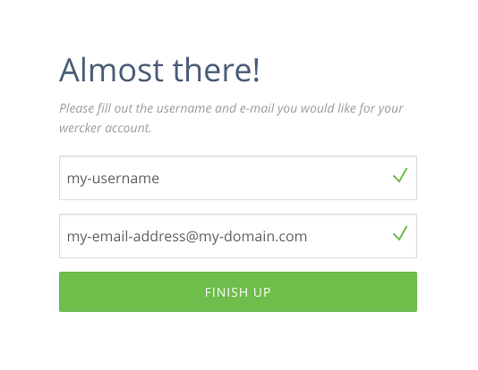
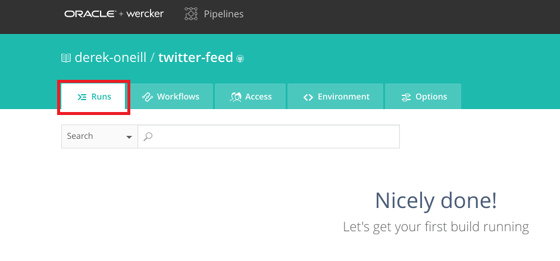
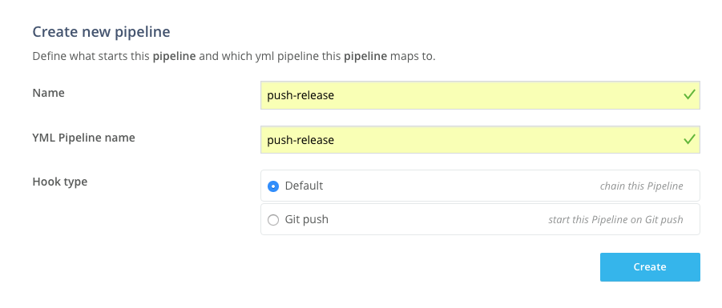
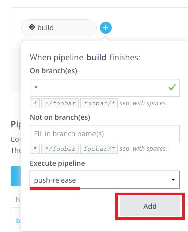
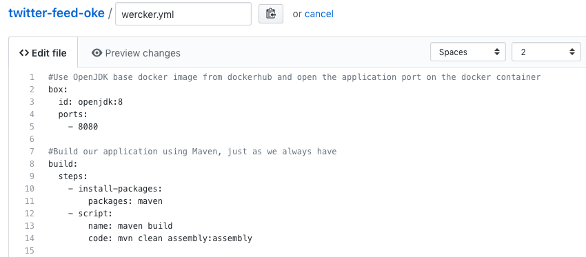
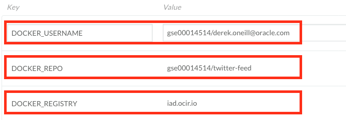
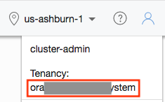
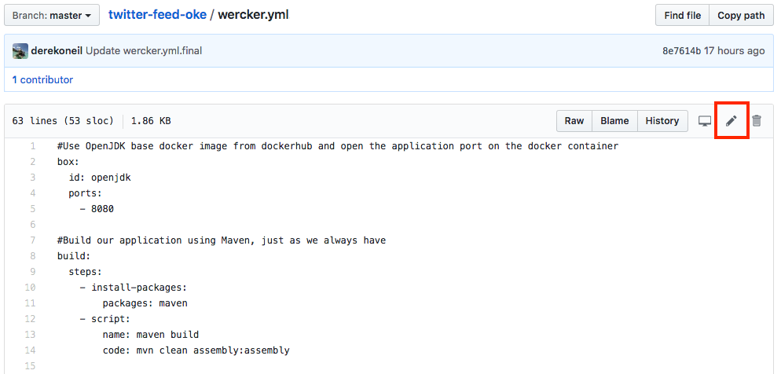
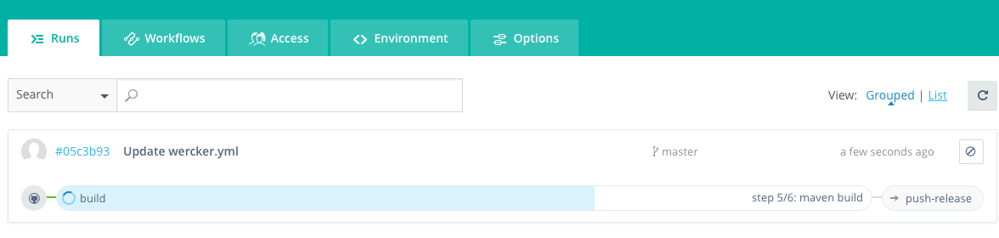
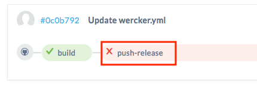

# Containerize Your Java Microservice

<!--  -->

## Introduction

본 Hands on Lab은 Container Native on OKE with Wercker 시리즈의 첫번째로, Oracle Cloud Infrastructure를 기반으로 Java로 만들어진 Application을 Container로 만들고 이를 Kubernetes Cluster환경에 배포하는 과정을 따라하면서 오라클의 컨테이너 기반 CI/CD 툴인 **Wercker**와 오라클의 쿠버네티스 서비스인 **OKE, Oracle Kubernetes Engine**을 경험해 보는 것을 목표로 합니다. 

## 학습목표

**자바 애플리케이션을 컨테이너로 만드는 일련의 과정을 자동화**

> Wercker는 네덜란드식 발음 **"베커"** 또는 영어식 발음 **"워커"**라고 부른다. 

- Wercker 애플리케이션 만들기 
  - GitHub에서 자바 애플리케이션 포크하기
  - Wercker 계정 만들기
  - Wercker 애플리케이션 만들기
- Wercker 파이프라인 생성 및 실행
  - 파이프라인과 워크플로우 생성
  - 빌드 파이프라인 정의
  - 환경변수 설정 
  - 배포 파이프라인 정의 
  - 워크플로우 실행 유효성 검사

## 선행 준비 사항 

이 Lab에서는 Github 계정이 필요합니다. 계정이 없으신 경우 아래 링크를 이용해 계정을 생성하세요.

  -  [GitHub account](https://github.com/join)

# 자바 애플리케이션을 컨테이너화하고 빌드 자동화하기 

## Wercker 애플리케이션 만들기

### **STEP 1**: GitHub에서 예제(자바) 애플리케이션 포크하기

- 브라우저에서 아래 링크로 이동:

    [https://github.com/derekoneil/twitter-feed-oke](https://github.com/derekoneil/twitter-feed-oke)

- 오른쪽 상단의 **Fork** 를 클릭하고 GitHub 계정으로 로그인 한다. 

  

### **STEP 2**: Wercker 계정 생성하기 

  **NOTE** Wercker 계정을 가지고 계신 계정을 이용하시면 되므로 **STEP 3**을 따라 하시면 됩니다. GitHub 계정으로 Wercker에 로그인 하기 위해 아래 과정을 따라 로그인 합니다. 

- 브라우저에서 아래 링크로 이동:
    [http://app.wercker.com/](http://app.wercker.com/)

- 오른쪽 상단 메뉴에 **Sign Up** 클릭하여 GitHub 계정으로 로그인

  

- **Sign Up Using GitHub** 클릭

  

-  **Authorize Wercker**  클릭

  

- Wercker에서 사용할 username과 email을 입력합니다. 

  

### **STEP 3**: Wercker 애플리케이션 생성

- Wercker 애플리케이션을 처음 만드는 경우는 파란색 **Create your first application** 버튼을 클릭. 이미 생성 경험이 있는 경우는 오른쪽위의 **plus button** 클릭하고  **Add application**를 클릭한다.:

  


- default 로 설정하고 **your account**  **GitHub**를 설정하고 **Next** 클릭

  

- 자신을 레포지터리에서 **twitter-feed-oke** 을 선택하고 **Next** 클릭

  

- default (without ssh key) 설정대로 하고 **Next** 클릭

  

- **Create** 클릭

  


## Wercker 빌드 파이프라인 생성 및 실행

### **STEP 4**: Pipelines Workflow 설정

- 새로 생성된 애플리케이션의 **Runs** 탭으로 이동, 이 Runs에서는 애플리케이션을 실행 이력을 볼 수 있다.  

  

- **Workflows** 탭을 이동. 이 워크플로우는 Git commit에 의해 기동(trigger)되며, **build** 라고 하는 파이프라인을 실행

  

- **build** 파이프라인은 애플리케이션 빌드와 Unit테스트에 이용된다. 새로운 파이프라인을 만들어 Docker image를 만들고 Docker Hub 레포지토리에 저장해 본다. **Add new pipeline** 버튼 클릭

  

- 파이프라인 Name과 YML Pipeline name 항목에 `push-release` 입력하고 **Create** 클릭

  

- 이제 파이프라인의 환경변수를 입력하는 항목은 비워둔다. **Workflows** 탭을 클릭해서 workflow editor 창으로 이동.

  

- **plus sign** 를 클릭.

  

- **Execute Pipeline** 항목에 좀전에 생성한 **push-release** 를 선택하고 **Add** 클릭.

  

- Now that we've got a workflow configured that will build and store a Docker image containing our application, we need to define exactly how to do that in a file called **wercker.yml**, which we will store in our application's Git repository.

### **STEP 5**: Wercker 빌드 파이프라인 정의

- 브라우저의 GitHub에 접속했던 탭으로 돌아가서, 좀전에 fork했던 **twitter-feed** 레포지토리에서 **Create new file** 클릭

  

- **Name your file...** 에 `wercker.yml` 입력

  

- **Edit new file** 에 다음 yaml 파일을 **붙여넣기** 한다.

    ```yaml
    #Use OpenJDK base docker image from dockerhub and open the application port on the docker container
    box:
      id: openjdk:8
      ports:
        - 8080

    #Build our application using Maven, just as we always have
    build:
      steps:
        - install-packages:
            packages: maven
        - script:
            name: maven build
            code: mvn clean assembly:assembly
    ```

- 에디터 창에 아래와 같은 YAML 파일을 갖게 된다. 

  

- YAML 파일의 첫번째 섹션은 docker base image를 정의하며, 두번째 섹션은 우리가 정의한 **Build** 파이프라인을 실행하도록 한다. 이 **Build** 파이프라인은 두개의 **steps** 로 구성되어 있다. 하나는  **install-packages** 필요한 패키지를 설치하고, 두번째는 shell 스크립트를 실행한다. 

- 화면의 제일 밑에 **Commit new file** 버튼을 클릭한다. 

  

- 브라우저의 **Wercker** 탭으로 돌아와서 **Runs** 탭을 보면 Git Commit에 의해 Trigger되서 실행되는 워크플로우를 볼수 있다. 

  

- **build** 파이프라인은 성공하지만, **push-release** 파이프라인은 아직 설정을 하지 않았기 때문에 실패한다. 

  

- 파란색 **build** 파이프라인을 클릭하면 실행 내역을 조회할 수 있고, 실패등의 이벤트를 이메일로 통지 받을 수 있다. 

  

- 이제 **push-release** 파이프라인을 수정해서 빌드한 컨테이너 이미지를 저장할 수 있는 **Oracle Container Image Registry(OCIR)** 의 환경변수를 설정한다. 

### **STEP 6**: Wercker에 환경 변수 설정

- Wercker 브라우저에서, **Environment** 탭 클릭.

  

- 아래 기재된 환경변수를 Key, Value 를 차례로 입력한다. 
  ```
  Key:              Value:
  DOCKER_USERNAME   <your-tenancy-name>/<your-oracle-cloud-username>
  DOCKER_REGISTRY   iad.ocir.io
  DOCKER_REPO       <your-tenancy-name>/twitter-feed
  ```

  

  **NOTES**:

  - 위의 `<your-tenancy-name>` and `<your-oracle-cloud-username>` in the variable values with the specific tenancy name and username for your cloud account.

  

  - Tenancy Name은 OCI Console 에 User menu에 있음:

  

  - Oracle Cloud username 은 로그인한 사용자 이메일 입니다. 

  - `DOCKER_REGISTRY`에는 **iad.ocir.io** 를 입력한다. 


### **STEP 7**: Wercker 게시 파이프라인 정의 

- Github 화면에서 **wercker.yml** 파일의 **연필모양 아이콘**  클릭.

  

- 제일 밑에 아래 파일을 **붙여넣기paste** 한다.

    ```yaml
    #Push the docker image with our built and tested application to the Oracle Container Registry
    push-release:
      steps:
        - internal/docker-push:
            username: $DOCKER_USERNAME
            password: $OCI_AUTH_TOKEN
            repository: $DOCKER_REGISTRY/$DOCKER_REPO
            registry: https://$DOCKER_REGISTRY/v2
            tag: $WERCKER_GIT_BRANCH-$WERCKER_GIT_COMMIT
            working-dir: /pipeline/source
            ports: 8080
            cmd: sh target/bin/start
    ```

  

- 이 섹션에서는 두번째 파이프라인인 **push-release**를 정의한다. **internal/docker-push** 스택은 내부 Docker Registry에 빌드한 Docker Image를 저장하는 스탭이다. 자세한 사항은 다음 참조 (http://devcenter.wercker.com/docs/steps/internal-steps#docker-push).

- 페이제 제일 밑에 **Commit changes** 클릭

  

### **STEP 8**: Validate Workflow Execution

- 앞에서 본것과 같이 Git Commit에 따라 빌드 프로세스가 시작된다. **Runs** 탭에서 확인

  

- `build` 파이프라인이 성공하고 `push-release` 가 진행되지만 마지막에 에러가 발생한다. 에러 메세지를 보면 `Anonymous users are only allowed read access on public repos` 권한 문제임을 알 수 있다. 다음 실습에서 해당 token을 추가해 보자.

  

  


**You are now ready to move to the next lab: [Lab 200](LabGuide200.md)**
