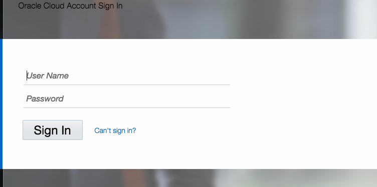
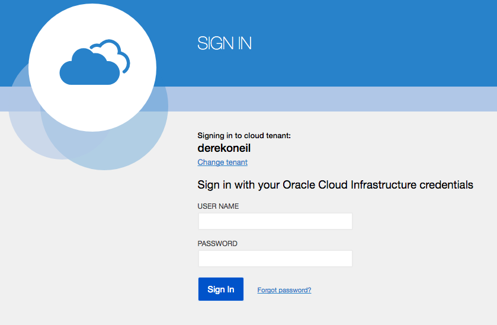
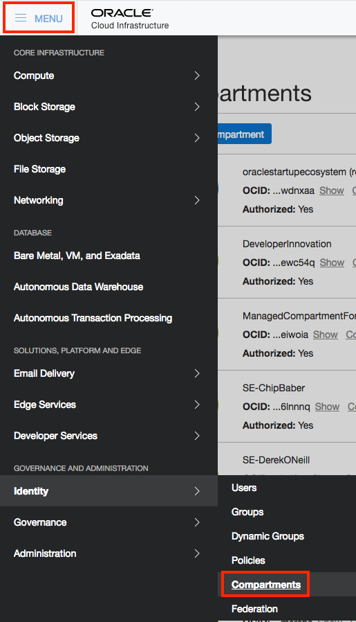
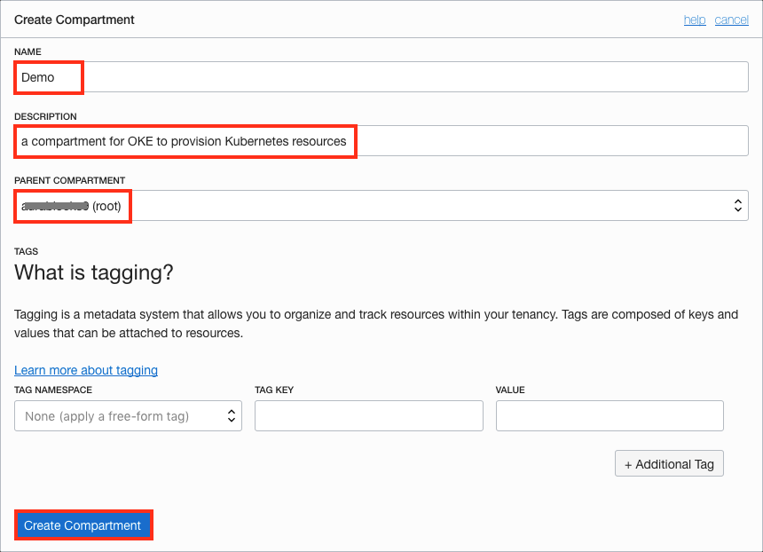
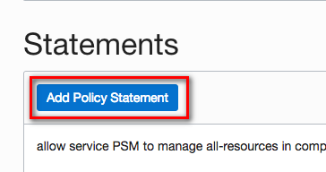
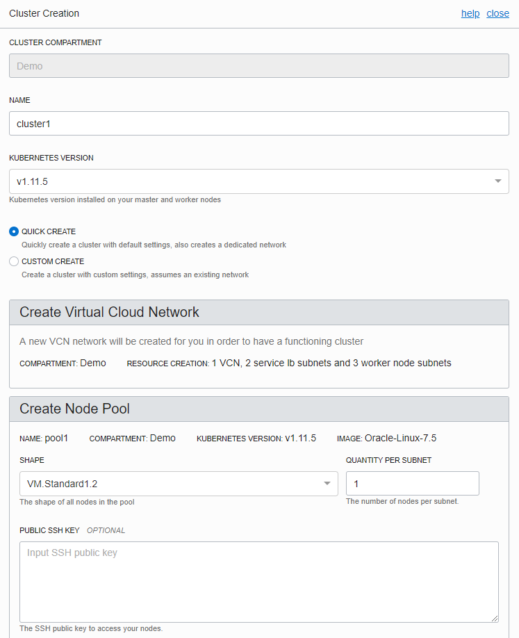

# OCI 콘솔을 이용한 쿠버네티스 클러스터 생성

## Oracle Cloud infrastructure 환경 설정

### **STEP 1**: OCI 대쉬보드 로그인

- 수신한 Trial Welcome 메일을 참조하여 **Username, Password, Cloud Account Name** 참조.

  

- 사전에 신청한 Trial 계정을 이용해 로그인, Trial 계정이 없는 경우 Workshop Instructor에게 요청

    [https://cloud.oracle.com/en_US/sign-in](https://cloud.oracle.com/en_US/sign-in)

- **Cloud Account Name** 정보 입력하고 **My Services** 버튼 클릭. 

  

-  **Username** 과  **Password** 를 입력하고 **Sign In** 클릭. 

  

- 대쉬보드의 좌측 상단 **hamburger menu** 클릭

  

- **Services** 메뉴 클릭하고 **Compute** 클릭

  

- 이렇게 하면 OCI 콘솔 로그인 화면이 나온다. 이는 오라클에는 OCI-Classic 서비스와 OCI 서비스가 있기 때문이며 위와 동일한 계정 정보로 한번 더 로그인 한다. 

  

### **STEP 2**: 쿠버네티스 노드를 위한 컴파트먼트(Compartment) 생성

 컴파트먼트는 OCI 테넌시의 리소스를 나누는 단위로 컴파트먼트내의 리소스는 권한에 따라 접근이 가능하며 서로 다른 컴파트먼트끼라는 분리된다. 

-  **hamburger icon** 를 클릭하여 **Identity** 메뉴에  **Compartments**를 클릭

  

  -  **Create Compartment** 클릭

   

  - **Name** 항목에 `Demo`를 입력하고 Description 항목에는 원하는 설명을 넣는다.  

    

### **STEP 3**: Add a Policy Statement for OKE

  - 쿠버네티스 서비스를 생성하기 전에 명시적으로 policy를 추가해야 한다. OCI 메뉴에서 **Identity->Policies** 선택

    

  - Compartment 드롭다운 메뉴에서 **root compartment**를 선택

    

  -  **PSM-root-policy** 클릭
  
     

  - **Add Policy Statement** 클릭

    

  - Statement 항목에, `allow service OKE to manage all-resources in tenancy` 복사해서 입력 하고 **Add Statement** 클릭

    

### **STEP 4**: OCI 콘솔을 이용한 쿠버네티스 클러스터 생성

  - 이제 쿠버네티스 클러스터를 만들 준비가 됐다. OCI 콘솔 메뉴에서 **Developer Services** -> **Container Clusters (OKE)** 를 선택.

    

  - Compartments 드롭다운 리스트에서 **Demo** 컴파트먼트를 선택.

    

  - **Create Cluster** 클릭

    

  - 데모를 간략히 하기 위해 디폴트로 선택된 그대로 클러스터를 생성한다. 

    
            
    
    - 사용자의 필요에 따라 클러스터 설정을 추가로 설정할 수 있다.
    - 현재 2가지 버전의 k8s를 사용가능 v1.11.5, v1.10.11
    - 디폴드 옵션은 클러스터를 위한 VCN(Virtual Cloud Network), 3개의 서브넷과 2개의 로드 발란서 그리고 각 서브넷에 Worker Node VM(총 3개) 이 생성된다. 
    - Node Pool에 구성할 Worker Node 설정 가능    

  - **Create** 클릭하면 클러스터와 연관된 자원들이 하나씩 생성되면서 클러스터 생성정보가 표시된다. 확인 후 **Close** 클릭

**[Lab 200으로](LabGuide200.md)**

