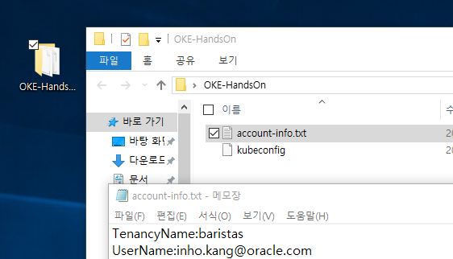
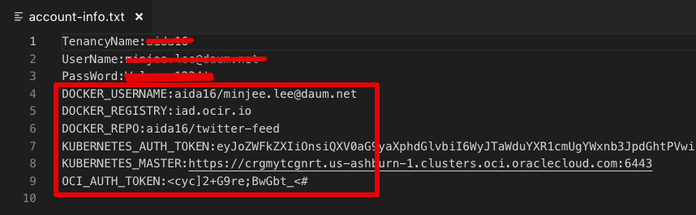
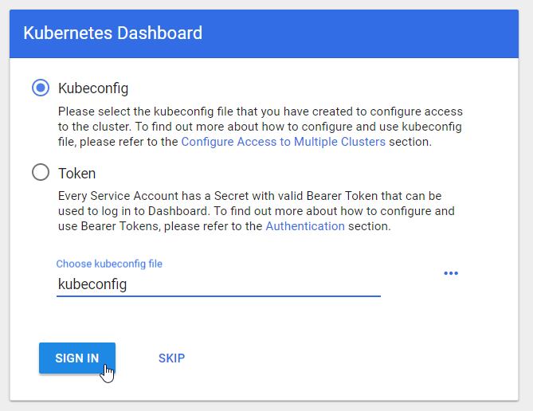

# 자바 애플리케이션을 컨테이너화하고 빌드 및 디폴로이 자동화하기 

## 학습목표

**컨테이너 기반 CI/CD 툴인 Wercker를 사용하여 자바 애플리케이션을 컨테이너로 빌드하고 쿠버네티스환경에 배포하는 일련의 과정을 자동화한다.**

> Wercker는 네덜란드식 발음으로는 **"베커"** 로, 영어식 발음으로는 **"워커"** 로 부른다.  

  
## Wercker 애플리케이션 만들기

### **STEP 1**: GitHub에서 예제(자바) 애플리케이션 포크하기

- 브라우저에서 아래 링크로 이동:

    [https://github.com/DannyKang/twitter-feed-oke](https://github.com/DannyKang/twitter-feed-oke)

- 오른쪽 상단의 **Fork** 를 클릭하고 GitHub 계정으로 로그인 한다. 

  
  
- 오른쪽 상단의 **Fork** 를 한번 더 클릭하고 자신의 GitHub으로 Fork한다.  

    

### **STEP 2**: Wercker 계정 생성하기 

  **NOTE** Wercker 계정을 가지고 계신 경우는 **STEP 3**을 따라 하면 된다. 
   GitHub 계정으로 Wercker에 로그인 하기 위해 아래 과정을 따라 로그인 한다.  

- 브라우저에서 아래 링크로 이동:
    [http://app.wercker.com/](http://app.wercker.com/)

- 오른쪽 상단 메뉴에 **Sign Up** 클릭하여 GitHub 계정으로 로그인

  

- **Sign Up Using GitHub** 클릭

  

-  **Authorize Wercker**  클릭

  

- Wercker에서 사용할 username과 email을 입력한다. 

  

### **STEP 3**: Wercker 애플리케이션 생성

- Wercker 애플리케이션을 처음 만드는 경우는 파란색 **Create your first application** 버튼을 클릭하고, 이미 생성 경험이 있는 경우는 오른쪽위의 **plus button** 클릭한뒤  **Add application**를 클릭한다.

  


- 소스코드를 가져올 대상을 **GitHub**으로 설정하고 **Next** 클릭

  

- 자신의 GitHub Repository 중에서 **twitter-feed-oke** 을 선택하고 **Next** 클릭

  

- default (without using SSH key)을 클릭하고 **Next** 클릭

  

- **Create** 클릭

  


## Wercker 빌드(Build) 파이프라인 생성 및 정의

### **STEP 4**: Pipelines Workflow 설정

- 새로 생성된 애플리케이션의 **Runs** 탭으로 이동, 이 Runs 탭에서는 애플리케이션의 실행 이력을 볼 수 있다.  

  

- **Workflows** 탭을 이동. 이 워크플로우는 Git commit에 의해 기동(trigger)되며, 현재는 기본 생성된 **build** 라고 하는 파이프라인만을 실행

  

- **build** 파이프라인은 애플리케이션 빌드와 Unit테스트에 이용된다.

- 브라우저의 GitHub에 접속했던 탭으로 돌아가서, 좀전에 fork했던 **twitter-feed** 레포지토리에서 **Create new file** 클릭

  

- **Name your file...** 에 `wercker.yml` 입력

  

- **Edit new file** 에 다음 yaml 파일을 **붙여넣기** 한다.

    ```yaml
    #Use OpenJDK base docker image from dockerhub and open the application port on the docker container
    box:
      id: openjdk:8
      ports:
        - 8080

    #Build our application using Maven, just as we always have
    build:
      steps:
        - install-packages:
            packages: maven
        - script:
            name: maven build
            code: mvn clean assembly:assembly
    ```

- 에디터 창에 아래와 같은 YAML 파일을 볼 수 있다. 

  

- YAML 파일의 첫번째 섹션은 docker base image를 정의하며, 두번째 섹션은 **Build** 파이프라인에서 실행할 것들을 정의한다. 이 **Build** 파이프라인은 두 개의 **steps** 로 구성되어 있다. 첫번째 **install-packages** 는 필요한 패키지를 설치하고, 두번째는 shell 스크립트를 실행한다. 

- 화면의 제일 밑에 **Commit new file** 버튼을 클릭한다. 

  

- 브라우저의 **Wercker** 탭으로 돌아와서 **Runs** 탭을 보면 Git Commit에 의해 Trigger되서 실행되는 워크플로우를 볼수 있다. 

  


## Wercker Push 파이프라인 생성 및 정의

### **STEP 5**: Wercker Build, push-release 파이프라인 정의

 - Build 파이프라이인을 만들었으니 만들어진 Docker image를 저장하는 Docker Hub 레포지토리에 저장해 본다. **Add new pipeline** 버튼 클릭

  

- 파이프라인 Name과 YML Pipeline name 항목에 `push-release` 입력하고 **Create** 클릭

  

- 일단은, 생성된 파이프라인의 환경변수를 입력하는 항목은 비워둔다. **Workflows** 탭을 클릭해서 workflow editor 창으로 이동.

  

- **plus sign** 를 클릭.

  

- **Execute Pipeline** 항목에 좀전에 생성한 **push-release** 를 선택하고 **Add** 클릭.

  

- Github 화면에서 **wercker.yml** 파일을 클릭하고, 수정하기 위해  **연필모양 아이콘**  클릭.

  

- 제일 밑에 아래 파일을 아래 내용을 복사해서 **붙여넣기** 한다.

    ```yaml
    #Push the docker image with our built and tested application to the Oracle Container Registry
    push-release:
      steps:
        - internal/docker-push:
            username: $DOCKER_USERNAME
            password: $OCI_AUTH_TOKEN
            repository: $DOCKER_REGISTRY/$DOCKER_REPO
            registry: https://$DOCKER_REGISTRY/v2
            tag: $WERCKER_GIT_BRANCH-$WERCKER_GIT_COMMIT
            working-dir: /pipeline/source
            ports: 8080
            cmd: sh target/bin/start
    ```

  

- 이 섹션에서는 두번째 파이프라인인 **push-release** 에서 실행할 내용을 정의한다. **internal/docker-push** 스텝은 내부 Docker Registry에 빌드한 Docker Image를 저장하는 스텝이다. 자세한 사항은 다음 참조 (http://devcenter.wercker.com/docs/steps/internal-steps#docker-push).

- 페이지 제일 밑에 **Commit changes** 클릭하여 저장

  


- 브라우저의 **Wercker** 탭으로 돌아와서 **Runs** 탭을 보면 Git Commit에 의해 Trigger되서 실행되는 워크플로우를 볼수 있다. 

  

- **build** 파이프라인은 성공하지만, **push-release** 파이프라인은 아직 설정을 하지 않았기 때문에 실패한다. **그림과 같이 실패 표시까지는 시간이 좀 걸리므로 다음으로 넘어간다.**

  

- 파란색 **build** 파이프라인을 클릭하면 실행 내역을 조회할 수 있으며, 빌드중에 실패하는 등의 이벤트를 이메일로 통지 받을 수 있다. 

  

- 여기서는 에러가 발생하는데 위의 설정 `$DOCKER_USERNAME`, `$OCI_AUTH_TOKEN` 등의 값이 설정되어 있지 않아서 그렇다. 빌드한 컨테이너 이미지를  **Oracle Container Infrastructure Registry(OCIR)** 에 저장할 수 있도록 환경변수를 설정한다


### **STEP 6**: Wercker에 환경 변수 설정

- 빌드한 컨테이너 이미지를 오라클 클라우드에 저장하고 운영하기 위해서는 오라클 클라우드의 계정정보를 Wercker의 환경변수로 설정해야 한다. 
- 이를 위해 OCI Console로 로그인해서 필요한 정보를 구한다.

> 본 Hands On은 시간관계상 미리 구성된 환경을 제공한다.
> 아래와 같이 바탕화면에 제공된 계정정보를 이용해 OCI Console에 로그인한다.  

 - 바탕화면/OKE-HandsOn  
   


- 다시 Wercker 브라우저에서, **Environment** 탭 클릭.

  

- 아래 기재된 환경변수를 Key, Value 를 차례로 입력한다. 
  ```
  Key:              Value:
  DOCKER_USERNAME   <your-tenancy-name>/<your-oracle-cloud-username>
  DOCKER_REGISTRY   iad.ocir.io
  DOCKER_REPO       <your-tenancy-name>/twitter-feed
  KUBERNETES_AUTH_TOKEN
  KUBERNETES_MASTER
  OCI_AUTH_TOKEN

  ```
- 바탕화면에 제공한 계정정보를 기반으로 위의 환경변수를 설정한다. 

  

- [시연] **OCIR(OCI Registry)** 에 접속해서 저장된 Image를 확인한다. 

## Wercker 배포(Deploy) 파이프라인 생성 및 실행

### **STEP 8**: wercker.yml 파일에 쿠버네티스 배포용 파이프라인 정의

  - **wercker.yml** 파일을 클릭하고 **연필** 버튼을 클릭

    

  - 아래의 YAML 을 **복사** 해서 제일 밑에 **붙여넣기** 한다. 

    ```yaml
    #Deploy our container from the Oracle Container Registry to the Oracle Container Engine (Kubernetes)
    deploy-to-cluster:
      box:
          id: alpine
          cmd: /bin/sh

      steps:

      - bash-template

      - kubectl:
          name: delete secret
          server: $KUBERNETES_MASTER
          token: $KUBERNETES_AUTH_TOKEN
          insecure-skip-tls-verify: true
          command: delete secret wercker; echo delete registry secret

      - kubectl:
          name: create secret
          server: $KUBERNETES_MASTER
          token: $KUBERNETES_AUTH_TOKEN
          insecure-skip-tls-verify: true
          command: create secret docker-registry wercker --docker-server=$DOCKER_REGISTRY --docker-email=nobody@oracle.com --docker-username=$DOCKER_USERNAME --docker-password='$OCI_AUTH_TOKEN'; echo create registry secret

      - script:
          name: "Visualise Kubernetes config"
          code: cat kubernetes.yml

      - kubectl:
          name: deploy twitter-feed to kubernetes
          server: $KUBERNETES_MASTER
          token: $KUBERNETES_AUTH_TOKEN
          insecure-skip-tls-verify: true
          command: apply -f kubernetes.yml
          
      - kubectl:
          name: deploy alpha-office-catalog to kubernetes
          server: $KUBERNETES_MASTER
          token: $KUBERNETES_AUTH_TOKEN
          insecure-skip-tls-verify: true
          command: apply -f alpha-office-product-catalog.kubernetes.yml
    ```

    >이것은 **deploy-to-cluster** 파이프라인을 정의한다. **kubectl**를 이용해 쿠버네티스 클러스터에 애플리케이션을 디플로이한다. 

    > **deploy-to-cluster** 파이프라인에서는 두개의 deploy를 한다. 하나는 위에서 빌드한 **twitter-feed** 애플리케이션이과 나머지 하나는 UI가 있는 WebApp 인 **alpha-office-product-catalog** 이다. 

-  **Commit new file** 클릭

  


### **STEP 9**: Wercker에서 deployment pipelines 설정

-  **[Wercker](https://app.wercker.com)**에서 **twitter-feed** 애플리케이션 선택.

  

- **Workflows** 탭에서 **Add new pipeline** 버튼 클릭.

  

-  이름으로 **deploy-to-cluster** 입력 . **Create** 클릭.

  

- Workflow 에디터로 돌아아기 위해 **Workflows** 탭 클릭

- **push-release**  파이프라인 옆 **플러스** 버튼 클릭해서 **deploy-to-cluster** 추가 하고 **Add** 클릭

  

- 이제 Workflow에 3개의 파이프라인이 아래와 같이 보인다. 
  


### **STEP 10**: Validate deployment

- 이제 모든 설정이 완료되었으므로 github에서 Commit에 의해 CI/CD 자동화를 테스트 볼 시간이다. 간단히 wercker.yml에서 **연필** 을 클릭해서 편집모드에서 빈 공백에 "enter"를 클릭한후 **Commit change** 를 클릭한다. 

  
  

- 이제 Wercker 화면으로 돌아가서 Pipeline 실행 결과를 확인한다. 
  

- 애플리케이션 실행확인

  **Windows**
  ```bash
  > set KUBECONIFIG=%USERPROFILE%\Desktop\OKE-HandsOn\kubeconfig
  > kubectl proxy
  ```


- 브라우저에서 [**Kubernetes dashboard**] 실행  
  http://localhost:8001/api/v1/namespaces/kube-system/services/https:kubernetes-dashboard:/proxy/

- 로컬에 있는 kubeconfig을 선택하고 사인하기  

  

- 왼쪽 Pods 메뉴에서 2개의 **twitter-feed** pod를 볼 수 있다. 더블클릭해서 자세한 정보를 볼 수 있다.  

  

- Service 메뉴에서 **product-catalog-service**를 클릭해서 서비스의 자세한 정보를 볼 수 있다.  

  

- **Details** 에서 **External endpoints**를 더블 클릭하면 지금 배포한 애플리케이션을 확인할 수 있다.  

  

- Alpha 문구의 제품 카탈로그 싸이트이다. **Crayola New Markers**를 클릭하면 해당 트위터의 피드를 볼 수 있다.  

  

- 이렇게 Oracle의 쿠버네티스 서비스인 OKE와 wercker 를 통한 Container 기반의 CI/CD를 경험해 보았다. 
