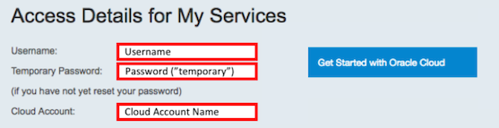
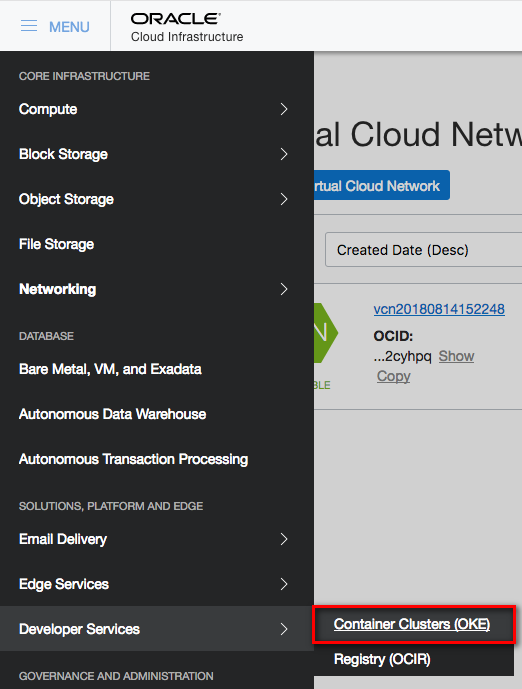
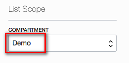
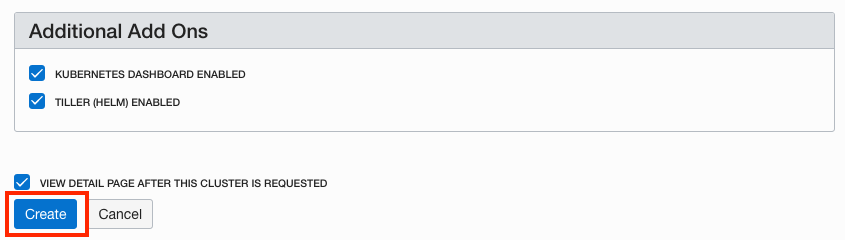
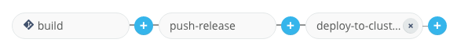
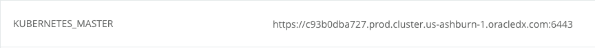
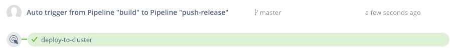

# OCI 콘솔을 이용한 쿠버네티스 클러스터 생성

## Objectives

**Automate Deployment to Kubernetes**

- Create and Deploy to a Kubernetes Cluster
  - Set Up Oracle Cloud infrastructure
  - Provision Kubernetes Using the OCI Console
  - Configure and Run Wercker Deployment Pipelines
  - Deploy and Test the Product Catalog Application

## Required Artifacts

  - an Oracle Cloud Trial Account

# OCI 콘솔을 이용한 쿠버네티스 클러스터 생성

## Oracle Cloud infrastructure 환결 설정

### **STEP 1**: OCI 대쉬보드 로그인

- 수신한 Trial Welcome 메일을 참조하여 **Username, Password, Cloud Account Name** 참조.

  

- 사전에 신청한 Trial 계정을 이용해 로그인, Trial 계정이 없는 경우 Workshop Instructor에게 요청

    [https://cloud.oracle.com/en_US/sign-in](https://cloud.oracle.com/en_US/sign-in)

- **Cloud Account Name** 정보 입력하고 **My Services** 버튼 클릭. 

  

-  **Username** 과  **Password** 를 입력하고 **Sign In** 클릭. 

  


- 대쉬보드의 좌측 상단 **hamburger menu** 클릭

  

- **Services** 메뉴 클릭하고 **Compute** 클릭

  

- 이렇게 하면 OCI 콘솔 로그인 화면이 나온다. 이는 오라클에는 OCI-Classic 서비스와 OCI 서비스가 있기 때문이로 위와 동일한 계정 정보로 한번 더 로그인 한다. 

  

### **STEP 2**: OCI 콘솔을 이용한 쿠버네티스 클러스터 생성

  - 이제 쿠버네티스 클러스터를 만들 준비가 됐다. OCI 콘솔 메뉴에서 **Developer Services->Container Clusters (OKE)**를 선택.

    

  - In the Compartments drop down, select the **Demo** compartment.

    

  - **Create Cluster** 클릭

    

  - 데모를 간략히 하기 위해 선택된 그대로 Create 버튼을 클릭한다. 

    
    

    - 사용자의 필요에 따라 클러스터 설정을 추가로 설정할 수 있다.
    - 현재 2가지 버전의 k8s를 사용가능 v1.15, v1.
    - 디폴드 옵션은 클러스터를 위한 VCN(Virtual Cloud Network), 3개의 서브넷과 2개의 로드 밸랜서 그리고 각 서브넷에 Worker Node VM(총 3개) 이 생성된다. 
    - Node Pool에 구성할 Worker Node 설정 가능

  - **Create** 클릭하면 클러스터 디테일 화면이 나온다. 

## Wercker 배포 파이프라인 생성 및 실행

### **STEP 8**: Define Kubernetes Deployment Specification

- From a browser, navigate to your forked twitter-feed repository on GitHub. If you've closed the tab, you can get back by going to [GitHub](https://github.com/), clicking the **Repositories** tab at the top of the page, and clicking the **twitter-feed-oke** link.

  

- Click **Create new file**

  

- In the **Name your file** input field, enter **kubernetes.yml.template**

  

- **Copy** the YAML below and **paste** it into the file editor.

    ```yaml
    apiVersion: extensions/v1beta1
    kind: Deployment
    metadata:
      name: twitter-feed-v1
      labels:
        commit: ${WERCKER_GIT_COMMIT}
    spec:
      replicas: 2
      selector:
        matchLabels:
          app: twitter-feed
      template:
        metadata:
          labels:
            app: twitter-feed
            commit: ${WERCKER_GIT_COMMIT}
        spec:
          containers:
          - name: twitter-feed
            image: ${DOCKER_REGISTRY}/${DOCKER_REPO}:${WERCKER_GIT_BRANCH}-${WERCKER_GIT_COMMIT}
            imagePullPolicy: Always
            ports:
            - name: twitter-feed
              containerPort: 8080
              protocol: TCP
          imagePullSecrets:
            - name: wercker
    ---
    apiVersion: v1
    kind: Service
    metadata:
      name: twitter-feed
      labels:
        app: twitter-feed
        commit: ${WERCKER_GIT_COMMIT}
    spec:
      ports:
      - port: 30000
        targetPort: 8080
      selector:
        app: twitter-feed
      type: ClusterIP
    ---
    ```
  >This configuration consists of two parts. The first section (up to line 28) defines a **Deployment**, which tells Kubernetes about the application we want to deploy. In this Deployment we instruct Kubernetes to create two Pods (`replicas: 2`) that will run our application. Within those pods, we specify that we want one Docker container to be run, and compose the link to the image for that container using environment variables specific to this workflow execution (`image: ${DOCKER_REPO}:${WERCKER_GIT_BRANCH}-${WERCKER_GIT_COMMIT}`).

  >The second part of the file defines a **Service**. A Service defines how Kubernetes should expose our application to traffic from outside the cluster. In this case, we are asking for a cluster-internal IP address to be assigned (`type: ClusterIP`). This means that our twitter feed will only be accessible from inside the cluster. This is ok, because the twitter feed will be consumed by the product catalog application that we will deploy later. We can still verify that our twitter feed is deployed properly -- we'll see how in a later step.

  >A `.yml` file is a common format for storing Kubernetes configuration data. The `.template` suffix in this file, however, is not a Kubernetes concept. We will use a Wercker step called **bash-template** to process any `.template` files in our project by substituting environment variables into the template wherever `${variables}` appear. You'll add that command to a new pipeline in the next step.

  - At the bottom of the page, click **Commit new file**

    

  - Since you've committed to the repository, Wercker will trigger another execution of your workflow. We haven't defined the deployment pipelines yet, so this will just result in a new entry in Wercker's Runs tab and a new image pushed to the container registry. You don't need to do anything with those; you can move on to the next step.

### **STEP 9**: Define Wercker Deployment Pipelines

  - Click the file **wercker.yml** and then click the **pencil** button to begin editing the file.

    

  - **Copy** the YAML below and **paste** it below the pipelines we defined earlier.

    ```yaml
    #Deploy our container from the Oracle Container Registry to the Oracle Container Engine (Kubernetes)
    deploy-to-cluster:
      box:
          id: alpine
          cmd: /bin/sh

      steps:

      - bash-template

      - kubectl:
          name: delete secret
          server: $KUBERNETES_MASTER
          token: $KUBERNETES_AUTH_TOKEN
          insecure-skip-tls-verify: true
          command: delete secret wercker; echo delete registry secret

      - kubectl:
          name: create secret
          server: $KUBERNETES_MASTER
          token: $KUBERNETES_AUTH_TOKEN
          insecure-skip-tls-verify: true
          command: create secret docker-registry wercker --docker-server=$DOCKER_REGISTRY --docker-email=nobody@oracle.com --docker-username=$DOCKER_USERNAME --docker-password='$OCI_AUTH_TOKEN'; echo create registry secret

      - script:
          name: "Visualise Kubernetes config"
          code: cat kubernetes.yml

      - kubectl:
          name: deploy to kubernetes
          server: $KUBERNETES_MASTER
          token: $KUBERNETES_AUTH_TOKEN
          insecure-skip-tls-verify: true
          command: apply -f kubernetes.yml
    ```

    >This will define a new **Pipeline** called deploy-to-cluster. The pipeline will make use of a new type of step: **kubectl**. If you have used Kubernetes before, you will be familiar with kubectl, the standard command line interface for managing Kubernetes. The kubectl Wercker step can be used to execute Kubernetes commands from within a Pipeline.

    >The **deploy-to-cluster** Pipeline will prepare our kubernetes.yml file by filling in some environment variables. It will then use kubectl to tell Kubernetes to apply that configuration to our cluster.

- At the bottom of the page, click **Commit new file**

  

- Since you've committed to the repository again, Wercker will once again trigger an execution of your workflow. We still haven't configured the deployment pipelines in Wercker yet, so we'll still end up with a new Run and a new image, but not a deployment to Kubernetes.

### **STEP 10**: Set up deployment pipelines in Wercker

- Open **[Wercker](https://app.wercker.com)** in a new tab or browser window, or switch to it if you already have it open. In the top navigation bar, click **Pipelines**, then click on your **twitter-feed** application.

  

- On the **Runs** tab you can see that Wercker has triggered another execution of our build and publish workflow, but it has not executed our new deploy-to-cluster pipeline. This is because we have not added the new pipeline to the workflow definition yet. Let's do that now -- click on the **Workflows** tab, then click the **Add new pipeline** button.

  

- Enter **deploy-to-cluster** into both the Name and YML Pipleine name fields. Click **Create**.

  

- Click the **Workflows** tab again to get back to the editor.

- Click the **plus** button to the right of the **push-release** pipeline to add to the workflow. In the **Execute Pipeline** drop down list, select **deploy-to-cluster** and click **Add**

  

- Your overall Workflow should now have three Pipelines:

  

- Now we've got our workflow updated with our deployment pipelines, but there's one more thing we need to do before we can actually deploy. We need to set a few environment variables that tell Wercker the address of our Kubernetes master and provide authentication tokens for Wercker to issue commands to Kubernetes and to OCI.

### **STEP 11**: Set up environment variables in Wercker

- Our first step is to set our cluster's authentication token as a Wercker environment variable. In your **terminal window**, run the following commands to output the token, then **select it and copy it** to your clipboard:

  **Windows**
    ```bash
    cd %USERPROFILE%\container-workshop
    cat kubeconfig | grep token | awk '{print $2}'
    ```

    **NOTE**: You may have to use Bash Shell or Git Bash to run the command above. If you don't have either one available, you can open the `kubeconfig` file in Notepad, find the `token:` section at the bottom of the file, and copy the token value from there.

      

  **Mac/Linux**
    ```bash
    cd ~/container-workshop
    cat kubeconfig | grep token | awk '{print $2}'
    ```

    

- Back in your Wercker browser tab, click the **Environment** tab. In the key field of the empty row below the last environment variable, enter the key **KUBERNETES_AUTH_TOKEN**. In the value field, **paste** the token we just copied. Check the **Protected** box and click **Add**.

  

- The next environment variable we need to add is the address of the Kubernetes master we want to deploy to. We can get the URL from `kubectl`. Run the following command in your **terminal window** to output the URL, then **select it and copy it** to your clipboard:

  **Windows**
    ```bash
    kubectl.exe config view | grep server | cut -f 2- -d ":" | tr -d " "
    ```

  **Mac/Linux**
    ```bash
    echo $(./kubectl config view | grep server | cut -f 2- -d ":" | tr -d " ")
    ```

- In your Wercker browser tab, add a new environment variable with the key **KUBERNETES_MASTER**. In the value field, **paste** the value you copied from `kubectl`. The value **must start with https://** for Wercker to communicate with the cluster. When finished, click **Add**.

  

  **NOTE**: You can also find this address in the OCI Console OKE page, by clicking on your cluster name to view the detail page:

    

- The last environment variable we need to create in Wercker is a token for Wercker to authenticate to OCI so that it can push our Docker image to the OCI Repository (OCIR). We will generate this authentication token in the OCI Console and then paste it into a Wercker environment variable. Add a new environment variable with the key **OCI_AUTH_TOKEN**.

  

- Switch to your **OCI Console** browser tab. Use the navigation menu to go to Identity->Users and select **View User Details** from the three-dots menu for your user. If you've closed the tab, [log in again](https://console.us-ashburn-1.oraclecloud.com).

  

  **NOTE**: You may see two users in the list, one that is named with just your email address, and another that is named `oracleidentitycloudservice`/your-email-address. **Choose the one that is named just your-email-address.**

- In the Resources menu of the user settings page, click **Auth Tokens**. Then click **Generate Token**.

  

  

- In the Description field, enter **Wercker Pipeline Token** and click **Generate Token**.

  

- Click the **Copy** link under the generated token, then click **Close**. Switch back to your Wercker browser tab and **Paste** this token into the Value field of the **OCI_AUTH_TOKEN** environment variable you started creating earlier. Check the **Protected** box and click **Save**.

  

  

- Lastly, let's go back and look at the `DOCKER_REGISTRY` variable to ensure that we have specified the correct region. In the **OCI Console**, look in the top right corner for the currently selected region:

  

  - If the region is `ashburn`, then you do not need to change anything. The URL `iad.ocir.io` is correct.

  - If the region is not `ashburn`, replace the `iad` part of the `DOCKER_REGISTRY` environment variable to match your region:

  ```
  London = lhr
  Frankfurt = fra
  Phoenix = phx
  Ashburn = iad
  ```

  - For example, if your region is `eu-frankfurt-1`, change the URL to `fra.ocir.io` and click the **save** button

    


- Now we're ready to try out our workflow from start to finish. We could do that by making another commit on GitHub, since Wercker is monitoring our source code. We can also trigger a workflow execution right from Wercker. We'll see how in the next step.

### **STEP 12**: Trigger a retry of the pipeline

- On your Wercker application page in your browser, click the **Runs** tab. Your most recent run should have a successful build pipeline and a failed push-release pipeline. Click the **push-release** pipeline.

  

- Click the **Retry** button.

  

- Click the **Runs** tab so you can monitor the execution of the pipeline. Within a minute or so, the deployment pipeline should complete successfully. Now we can use the Kubernetes dashboard to inspect and validate our deployment.

  

### **STEP 13**: Validate deployment

- First we will validate that our Docker image is visible in the OCI Registry. In your **OCI Console** browser tab, select **Registry (OCIR)** from the navigation menu, under the Developer Services category.

  

- Click on **twitter-feed** to expand the list of images, then click **master-xxxx** to view the details. This confirms that our image was pushed to the right place. The git branch and commit hash help us connect this image with the specific code version on GitHub.

  

- If you prefer to use the command line as opposed to the web browser method of testing the service, run the following command to verify that our microservice is returning JSON data:

  **Mac/Linux/Git Bash**
  ```bash
  export KUBECONFIG=~/container-workshop/kubeconfig
  ./kubectl exec -it $(./kubectl get pod -l "app=twitter-feed" -o jsonpath='{.items[0].metadata.name}') -- /bin/sh -c '/usr/bin/curl -s http://$HOSTNAME:8080/statictweets | head -c 1000; echo'
  ```

  **Windows PowerShell**
  ```bash
  $env:KUBECONFIG="path\to\your\kubeconfig"
  .\kubectl exec -it $(.\kubectl get pod -l "app=twitter-feed" -o jsonpath='{.items[0].metadata.name}') -- /bin/sh -c '/usr/bin/curl -s http://$HOSTNAME:8080/statictweets | head -c 1000; echo'
  ```

  - If you see JSON data returned, **skip to Step 14** where we will deploy the other components of our product catalog application. Otherwise, if the commands didn't work, you don't have PowerShell, or you prefer a browser-based interface, continue on:

- In a terminal window, start the **kubectl proxy** using the following command. Your `KUBECONFIG` environment variable should still be set from a previous step. If not, reset it.

  ```bash
  kubectl proxy
  ```

- In a browser tab, navigate to the [**Kubernetes dashboard**](http://localhost:8001/api/v1/namespaces/kube-system/services/https:kubernetes-dashboard:/proxy/)

- You should see the overview page. In the pods section, you should see two twitter-feed pods running. Click the **name of one of the pods** to go to the detail page.

  

- On the pod detail page, in the top menu bar, click **Exec**. This will give us a remote shell on the pod where we can verify that our application is up and running.

  

- In the shell that is displayed, **paste** the following command and press **Enter**.

  **NOTE:** You may need to use ctrl-shift-v to paste. Alternatively, you can use the mouse-driven browser menu to paste the command.

  `curl -s http://$HOSTNAME:8080/statictweets | head -c 100`

- You should see some JSON data being returned by our twitter feed service. Our microservice has been deployed successfully! But the twitter feed service is just one part of our product catalog application. Let's deploy the rest of the application so we can validate that everything works together as expected. Leave this browser tab open, as we will use it in a later step.

  

**NOTE**: You may be wondering why we had to use the Kubernetes remote terminal to test our application. Remember the kubernetes.yml file that we created earlier -- we specified a cluster-internal IP address for our twitter-feed service. This means that only other processes inside the cluster can reach our service. If we wanted to access our service from the internet, we could have used a load balancer instead.

## Deploy and Test the Product Catalog Application

### **STEP 14**: Download the Product Catalog Kubernetes YAML file

- From a browser, navigate to your forked twitter-feed repository on GitHub. If you've closed the tab, you can get back by going to [GitHub](https://github.com/), clicking the **Repositories** tab at the top of the page, and clicking the **twitter-feed-oke** link.

  

- Click on the **alpha-office-product-catalog.kubernetes.yml** file.

  

- Right click on the **Raw** button and choose **Save Link As** or **Save As**. In the save file dialog box that appears, note the location of the file and click **Save**

  

**NOTE**: This YAML file contains the configuration for a Kubernetes deployment and service, much like the configuration for our twitter feed microservice. In a normal development environment, the product catalog application would be managed by Wercker as well, so that builds and deploys would be automated. In this workshop, however, you will perform a one-off deployment of a pre-built Docker image containing the product catalog application from within the Kubernetes dashboard.

### **STEP 15**: Deploy and test the Product Catalog using the Kubernetes dashboard

- Switch back to your **Kubernetes dashboard** browser tab. If you have closed it, navigate to the Kubernetes dashboard at [**Kubernetes dashboard**](http://localhost:8001/api/v1/namespaces/kube-system/services/https:kubernetes-dashboard:/proxy/)

- In the upper right corner of the dashboard, click **Create**.

  

- Click the **Create From File** tab, then click the **three dots** button to browse for your file. In the dialog, select the YAML file you just downloaded from GitHub and click **Open**, then click **UPLOAD**.

  

- In the left side navigation menu, click **Overview**. You should see two new product-catalog-app pods being created and soon change state to Running.

  

- Instead of a cluster-internal IP address, the product-catalog-service will be exposed to the internet via a load balancer. The load balancer will take a few minutes to be instantiated and configured. Let's check on its status--click **Services** from the left side menu, then click on the **product-catalog-service**.

  

- On the service detail page, you will see a field called **External endpoints**. Once the load balancer has finished provisioning, the External endpoints field will be populated with a link to the product catalog application. If the link is not shown yet, wait a few minutes, refresh your browser, and check again. Once the link is displayed, **click it** to launch the site in a new tab.

  

- You should see the product catalog site load successfully, validating that our new Kubernetes deployment and service were created correctly. Let's test the twitter feed functionality of the catalog. Click the first product, **Crayola New Markers**. The product's twitter feed should be displayed.

  

  **NOTE**: You may have noticed that we did not need to alter the pre-built product catalog container with the URLs of the twitter feed pods or service. The product catalog app makes use of Kubernetes DNS to resolve the service name (twitter-feed) into its IP address. Kubernetes DNS assigns a DNS name to every service defined in your cluster, so any service can be looked up by doing a DNS query for the name of the service (prefixed by _`namespace.`_ if the service is in a different namespace from the requester). The product catalog server uses the following JavaScript code to make an HTTP request to the twitter feed microservice:

  `request('http://twitter-feed:30000/statictweets/color', function (error, response, body) { ... });`

- Some tweets are indeed displayed, but they aren't relevant to this product. It looks like there is a bug in our twitter feed microservice! Continue on to the next lab to explore how to make bug fixes and updates to our microservice.

**You are now ready to move to the next lab: [Lab 300](LabGuide300.md)**
