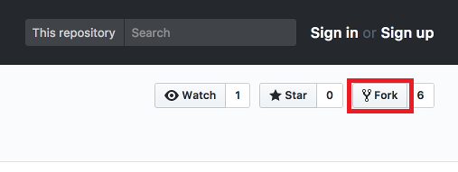
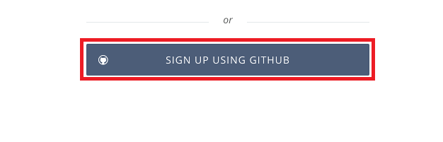
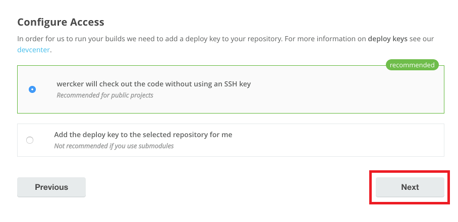
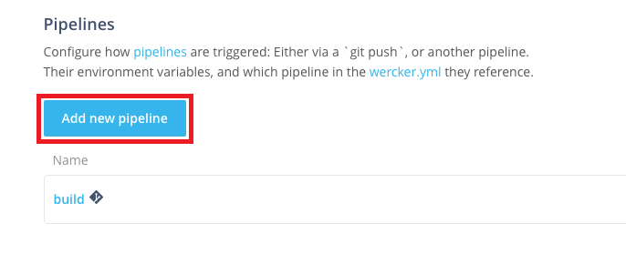
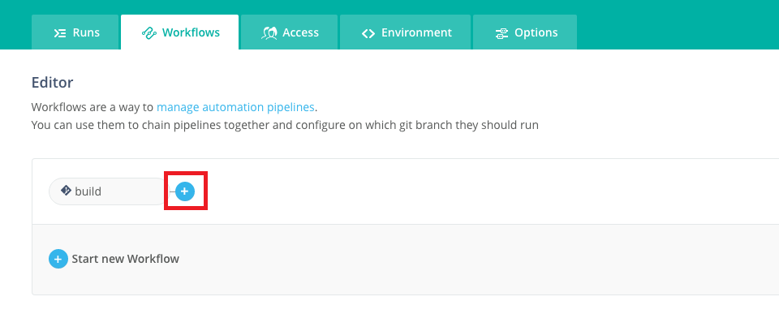

# 자바 애플리케이션을 컨테이너화하고 빌드 자동화하기 

## 학습목표

**Wercker를 사용하여 자바 애플리케이션을 컨테이너로 만드는 쿠버네티스환경에 배포 하는 일련의 과정을 자동화한다.**

> Wercker는 네덜란드식 발음으로는 **"베커"** 또는 영어식 발음 **"워커"** 로 부른다.  

## 선행 준비 사항 

이 Lab에서는 Github 계정이 필요합니다. 계정이 없으신 경우 아래 링크를 이용해 계정을 생성하세요.

  -  [GitHub account](https://github.com/join)

  
## Wercker 애플리케이션 만들기

### **STEP 1**: GitHub에서 예제(자바) 애플리케이션 포크하기

- 브라우저에서 아래 링크로 이동:

    [https://github.com/DannyKang/twitter-feed-oke](https://github.com/DannyKang/twitter-feed-oke)

- 오른쪽 상단의 **Fork** 를 클릭하고 GitHub 계정으로 로그인 한다. 

  
  
- 오른쪽 상단의 **Fork** 를 한번 더 클릭하고 자신의 GitHub으로 Fork합니다. 

    

### **STEP 2**: Wercker 계정 생성하기 

  **NOTE** Wercker 계정을 가지고 계신 경우는 **STEP 3**을 따라 하시면 됩니다.
   GitHub 계정으로 Wercker에 로그인 하기 위해 아래 과정을 따라 로그인 합니다. 

- 브라우저에서 아래 링크로 이동:
    [http://app.wercker.com/](http://app.wercker.com/)

- 오른쪽 상단 메뉴에 **Sign Up** 클릭하여 GitHub 계정으로 로그인

  

- **Sign Up Using GitHub** 클릭

  

-  **Authorize Wercker**  클릭

  

- Wercker에서 사용할 username과 email을 입력합니다. 

  

### **STEP 3**: Wercker 애플리케이션 생성

- Wercker 애플리케이션을 처음 만드는 경우는 파란색 **Create your first application** 버튼을 클릭. 이미 생성 경험이 있는 경우는 오른쪽위의 **plus button** 클릭하고  **Add application**를 클릭한다.:

  


- default 로 설정하고 소스코드를 가져올 대상을 **GitHub**를 설정하고 **Next** 클릭

  

- 자신의 GitHub Repository 중에서 **twitter-feed-oke** 을 선택하고 **Next** 클릭

  

- default (without using SSH key)을 클릭하고 **Next** 클릭

  

- **Create** 클릭

  


## Wercker 빌드 파이프라인 생성 및 실행

### **STEP 4**: Pipelines Workflow 설정

- 새로 생성된 애플리케이션의 **Runs** 탭으로 이동, 이 Runs 탭에서는 애플리케이션의 실행 이력을 볼 수 있다.  

  

- **Workflows** 탭을 이동. 이 워크플로우는 Git commit에 의해 기동(trigger)되며, 현재는 기본 생성된 **build** 라고 하는 파이프라인만을 실행

  

- **build** 파이프라인은 애플리케이션 빌드와 Unit테스트에 이용된다. 새로운 파이프라인을 만들어 Docker image를 만들고 Docker Hub 레포지토리에 저장해 본다. **Add new pipeline** 버튼 클릭

  

- 파이프라인 Name과 YML Pipeline name 항목에 `push-release` 입력하고 **Create** 클릭

  

- 이제 파이프라인의 환경변수를 입력하는 항목은 비워둔다. **Workflows** 탭을 클릭해서 workflow editor 창으로 이동.

  

- **plus sign** 를 클릭.

  

- **Execute Pipeline** 항목에 좀전에 생성한 **push-release** 를 선택하고 **Add** 클릭.

  

- 이제 워크플로우를 설정했으므로 이 워크플로우가 구체적으로 어떤 일을 할지를 정의하는 설정 파일인 **wercker.yml** 을 구성해야 한다. 

### **STEP 5**: Wercker 빌드 파이프라인 정의

- 브라우저의 GitHub에 접속했던 탭으로 돌아가서, 좀전에 fork했던 **twitter-feed** 레포지토리에서 **Create new file** 클릭

  

- **Name your file...** 에 `wercker.yml` 입력

  

- **Edit new file** 에 다음 yaml 파일을 **붙여넣기** 한다.

    ```yaml
    #Use OpenJDK base docker image from dockerhub and open the application port on the docker container
    box:
      id: openjdk:8
      ports:
        - 8080

    #Build our application using Maven, just as we always have
    build:
      steps:
        - install-packages:
            packages: maven
        - script:
            name: maven build
            code: mvn clean assembly:assembly
    ```

- 에디터 창에 아래와 같은 YAML 파일을 볼 수 있다. 

  

- YAML 파일의 첫번째 섹션은 docker base image를 정의하며, 두번째 섹션은 우리가 정의한 **Build** 파이프라인을 실행하도록 한다. 이 **Build** 파이프라인은 두개의 **steps** 로 구성되어 있다. 하나는  **install-packages** 필요한 패키지를 설치하고, 두번째는 shell 스크립트를 실행한다. 

- 화면의 제일 밑에 **Commit new file** 버튼을 클릭한다. 

  

- 브라우저의 **Wercker** 탭으로 돌아와서 **Runs** 탭을 보면 Git Commit에 의해 Trigger되서 실행되는 워크플로우를 볼수 있다. 

  

- **build** 파이프라인은 성공하지만, **push-release** 파이프라인은 아직 설정을 하지 않았기 때문에 실패한다. 

  

- 파란색 **build** 파이프라인을 클릭하면 실행 내역을 조회할 수 있으며, 빌드중에 실패하는 등의 이벤트를 이메일로 통지 받을 수 있다. 

  

- 이제 **push-release** 파이프라인을 수정해서 빌드한 컨테이너 이미지를  **Oracle Container Infrastructure Registry(OCIR)** 에 저장하도록 환경변수를 설정한다. 

### **STEP 6**: Wercker에 환경 변수 설정

- Wercker 브라우저에서, **Environment** 탭 클릭.

  

- 아래 기재된 환경변수를 Key, Value 를 차례로 입력한다. 
  ```
  Key:              Value:
  DOCKER_USERNAME   <your-tenancy-name>/<your-oracle-cloud-username>
  DOCKER_REGISTRY   iad.ocir.io
  DOCKER_REPO       <your-tenancy-name>/twitter-feed
  ```

  

  **NOTES**:

  

  - `DOCKER_USERNAME`의 `<your-tenancy-name>`는 OCI Console 에 User menu에 있음:

  

  - `DOCKER_USERNAME`의 `<your-oracle-cloud-username>` 은 로그인한 사용자 이메일 입니다. 

  - `DOCKER_REGISTRY`에는 **iad.ocir.io** 를 입력한다. 


### **STEP 7**: Wercker push 파이프라인 정의 

- Github 화면에서 **wercker.yml** 파일의 **연필모양 아이콘**  클릭.

  

- 제일 밑에 아래 파일을 **붙여넣기paste** 한다.

    ```yaml
    #Push the docker image with our built and tested application to the Oracle Container Registry
    push-release:
      steps:
        - internal/docker-push:
            username: $DOCKER_USERNAME
            password: $OCI_AUTH_TOKEN
            repository: $DOCKER_REGISTRY/$DOCKER_REPO
            registry: https://$DOCKER_REGISTRY/v2
            tag: $WERCKER_GIT_BRANCH-$WERCKER_GIT_COMMIT
            working-dir: /pipeline/source
            ports: 8080
            cmd: sh target/bin/start
    ```

  

- 이 섹션에서는 두번째 파이프라인인 **push-release**를 정의한다. **internal/docker-push** 스택은 내부 Docker Registry에 빌드한 Docker Image를 저장하는 스탭이다. 자세한 사항은 다음 참조 (http://devcenter.wercker.com/docs/steps/internal-steps#docker-push).

- 페이제 제일 밑에 **Commit changes** 클릭

  

### **STEP 8**: Validate Workflow Execution

- 앞에서 본것과 같이 Git Commit에 따라 빌드 프로세스가 시작된다. **Runs** 탭에서 확인

  

- `build` 파이프라인이 성공하고 `push-release` 가 진행되지만 마지막에 에러가 발생한다. 에러 메세지를 보면 `Anonymous users are only allowed read access on public repos` 권한 문제임을 알 수 있다. 다음 실습에서 해당 token을 추가해 보자.

  

  


## Wercker 배포 파이프라인 생성 및 실행

### **STEP 9**: 쿠버네티스 배포 설정 추가 

- GitHub 화면에서 기존에 fork한 **twitter-feed** 리포지토리 클릭

  

- **Create new file** 클릭

  

- **Name your file** 에 **kubernetes.yml.template** 입력

  

- 아래 YAML **Copy** & and **paste** .

    ```yaml
    apiVersion: extensions/v1beta1
    kind: Deployment
    metadata:
      name: twitter-feed-v1
      labels:
        commit: ${WERCKER_GIT_COMMIT}
    spec:
      replicas: 2
      selector:
        matchLabels:
          app: twitter-feed
      template:
        metadata:
          labels:
            app: twitter-feed
            commit: ${WERCKER_GIT_COMMIT}
        spec:
          containers:
          - name: twitter-feed
            image: ${DOCKER_REGISTRY}/${DOCKER_REPO}:${WERCKER_GIT_BRANCH}-${WERCKER_GIT_COMMIT}
            imagePullPolicy: Always
            ports:
            - name: twitter-feed
              containerPort: 8080
              protocol: TCP
          imagePullSecrets:
            - name: wercker
    ---
    apiVersion: v1
    kind: Service
    metadata:
      name: twitter-feed
      labels:
        app: twitter-feed
        commit: ${WERCKER_GIT_COMMIT}
    spec:
      ports:
      - port: 30000
        targetPort: 8080
      selector:
        app: twitter-feed
      type: ClusterIP
    ---
    ```
  >이 환경 설정 파일 쿠버네티스의 **Deployment**와 **Service** 를 정의하는 파일 입니다. **Deployment** 섹션에서는 (`replicas: 2`)와 같이 Pod를 2개 띄우도록 설정합니다. **Service**에서는 애플리케이션을 어떻게 외부에 노출할 것인가를 나타낸다. (`type: ClusterIP`)를 설정하여, cluster-internal IP 롤 설정하여 이 애플리케이션(twitter feed)는 클러스터 내부에서만 접근이 가능하다. y that our twitter feed is deployed properly -- we'll see how in a later step.

  > 쿠버네티스에서는 설정을 일반적으로 `.yml` 파일 형식으로 저장한다.   `.template` 파일은 쿠버네티스 컨셉은 아니고 Wercker가 환경변수를 설정하기 위해 사용한다. Wercker 내에서 **bash-template** 스텝에서 `.template` 파일속의 환경변수 `${variables}` 설정하게 된다. 

  - 제일 밑에 **Commit new file** 클릭

    

  - Commit을 클릭하면 Wercker가 트리거되서 새로운 워크플로우가 실행된다. 

### **STEP 9**: Wercker Deployment Pipelines 설정

  - **wercker.yml** 파일을 클릭하고 **연필** 버튼을 클릭

    

  - 아래의 YAML 을 **복사** 해서 제일 밑에 **붙여넣기** 한다. 

    ```yaml
    #Deploy our container from the Oracle Container Registry to the Oracle Container Engine (Kubernetes)
    deploy-to-cluster:
      box:
          id: alpine
          cmd: /bin/sh

      steps:

      - bash-template

      - kubectl:
          name: delete secret
          server: $KUBERNETES_MASTER
          token: $KUBERNETES_AUTH_TOKEN
          insecure-skip-tls-verify: true
          command: delete secret wercker; echo delete registry secret

      - kubectl:
          name: create secret
          server: $KUBERNETES_MASTER
          token: $KUBERNETES_AUTH_TOKEN
          insecure-skip-tls-verify: true
          command: create secret docker-registry wercker --docker-server=$DOCKER_REGISTRY --docker-email=nobody@oracle.com --docker-username=$DOCKER_USERNAME --docker-password='$OCI_AUTH_TOKEN'; echo create registry secret

      - script:
          name: "Visualise Kubernetes config"
          code: cat kubernetes.yml

      - kubectl:
          name: deploy twitter-feed to kubernetes
          server: $KUBERNETES_MASTER
          token: $KUBERNETES_AUTH_TOKEN
          insecure-skip-tls-verify: true
          command: apply -f kubernetes.yml
          
      - kubectl:
          name: deploy alpha-office-catalog to kubernetes
          server: $KUBERNETES_MASTER
          token: $KUBERNETES_AUTH_TOKEN
          insecure-skip-tls-verify: true
          command: apply -f alpha-office-product-catalog.kubernetes.yml
    ```

    >이것은 **deploy-to-cluster** 파이프라인을 정의한다. **kubectl**를 이용해 쿠버네티스 클러스터에 애플리케이션을 디플로이한다. 

    > **deploy-to-cluster** 파이프라인에서는 두개의 deploy를 한다. 하나는 위에서 빌드한 **twitter-feed** 애플리케이션이과 나머지 하나는 UI가 있는 WebApp 인 **alpha-office-product-catalog** 이다. 

-  **Commit new file** 클릭

  


### **STEP 10**: Wercker에서 deployment pipelines 설정

-  **[Wercker](https://app.wercker.com)**에서 **twitter-feed** 애플리케이션 선택.

  

-  **Workflows** 탑에서 **Add new pipeline** 버튼 클릭.

  

-  **deploy-to-cluster** 입력 . **Create** 클릭.

  

- Click the **Workflows** tab again to get back to the editor.

- **push-release**  파이프라인 옆 **플러스** 버튼 클릭해서 **deploy-to-cluster** 추가 하고 **Add** 클릭

  

- 이제 Workflow에 3개의 파이프라인아 아래와 같이 보인다. 
  


### **STEP 11**: Wercker 환경변수 설정

- **KUBERNETES_AUTH_TOKEN** 설정, **terminal window**에서 아래 명령어 실행

  **Windows**
    ```bash
    cd %USERPROFILE%\container-workshop
    cat kubeconfig | grep token | awk '{print $2}'
    ```

    

  **Mac/Linux**
    ```bash
    cd ~/container-workshop
    cat kubeconfig | grep token | awk '{print $2}'
    ```

    

- Wercker의 **Environment** 탭에서 **KUBERNETES_AUTH_TOKEN**의 Key Value 쌍을 입력 **Protected** 박스를 체크하고 **Add** 클릭.

  

- **KUBERNETES_MASTER** 설정, **terminal window**에서 아래 명령어 실행

  **Windows**
    ```bash
    kubectl.exe config view | grep server | cut -f 2- -d ":" | tr -d " "
    ```

  **Mac/Linux**
    ```bash
    echo $(./kubectl config view | grep server | cut -f 2- -d ":" | tr -d " ")
    ```

- **KUBERNETES_MASTER** Key에 위에서 복사한 값을 추가하다. 이때 꼭 **https://** 를 추가해야 한다. 

  

  **NOTE**: OCI 콘솔의 OKE 페이지에서도 k8s master정보를 찾을 수 있다. 

    

- **OCI_AUTH_TOKEN** 생성, OCI Registry (OCIR) 에 접근하기 위한 인증 토근 생성 

  

- **OCI Console** 브라우저에서 **Identity->Users** 에서 **View User Details** 클릭

  

  **NOTE**: 두개의 유저가 보일 것이다. 이메일 주소만 있는 짧은 사용자 명을 선택한다.

- **Auth Tokens** 클릭 **Generate Token** 클릭해서 토큰 생성.

  

  

- Description에 **Wercker Pipeline Token** 라고 입력하고 **Generate Token** 클릭.

  

- **Copy** 클릭하고 Wercker로 가서 **OCI_AUTH_TOKEN** 환경변수에 **붙여넣기** 하고 **Protected**를 체크하고, **Save** 클릭.

  

  


### **STEP 13**: Validate deployment

- 이제 모든 설정이 완료되었으므로 github에서 Commit에 의해 CI/CD 자동화를 테스트 볼 시간이다. 간단히 wercker.yml에서 **연필** 을 클릭해서 편집모드에서 빈 공백에 "enter"를 클릭한후 **Commit change** 를 클릭한다. 

  
  

- 이제 Wercker 화면으로 돌아가서 Pipeline 실행 결과를 확인한다. 
  

- 애플리케이션 실행확인

  **Windows PowerShell**
  ```bash
  $set KUBECONIFIG=$HOME\Desktop\OKE-HandsOn\config
  kubectl proxy
  ```


- 브라우저에서 [**Kubernetes dashboard**] 실행  
  http://localhost:8001/api/v1/namespaces/kube-system/services/https:kubernetes-dashboard:/proxy/

- 왼쪽 Pods 메뉴에서 2개의 **twitter-feed** pod를 볼 수 있다. 더블클릭해서 자세한 정보를 볼 수 있다.
  

- Service 메뉴에서 **product-catalog-service**를 클릭해서 서비스의 자세한 정보를 볼 수 있다.

  

- **Details** 에서 **External endpoints**를 더블 클릭하면 지금 배포한 애플리케이션을 확인할 수 있다.

  

- Alpha 문구의 제품 카탈로그 싸이트이다. **Crayola New Markers**를 클릭하면 해당 트위터의 피드를 볼 수 있다.

  

- 이렇게 Oracle의 쿠버네티스 서비스인 OKE와 wercker 를 통한 Container 기반의 CI/CD를 경험해 보았다. 
